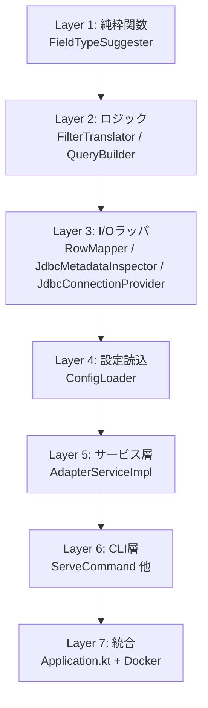

# 初回実装の設計（フェーズ1）

| 項目 | 内容 |
|---|---|
| 作業タイトル | initial-implementation |
| 作成日 | 2026-05-15 |
| ステータス | ドラフト（承認待ち） |
| 親文書 | [docs/functional-design.md](../../docs/functional-design.md), [docs/architecture.md](../../docs/architecture.md) |

---

## 1. 実装アプローチ

### 1.1 全体方針

- **TDD（Red → Green → Refactor）** で進める
- **純粋関数 → 副作用ありの順** で実装：内側から外側へ
- **小さなコミット単位**：1ケース1テスト1コミットを目安
- **モジュール境界の早期確立**：データクラスとインターフェース定義を最初に行い、その後に実装を埋める

### 1.2 内側から外側への実装順序



**理由**: 純粋関数は依存ゼロで TDD しやすい。徐々に外側へ進むことで、テスト難易度を段階的に上げる。

### 1.3 マイルストーン定義（要件§11.2 を具体化）

| マイルストーン | 完了基準 | 概算工数 |
|---|---|---|
| **M1** | Layer 1〜2 完成（純粋ロジックの単体テスト 100% パス） | 〜3日 |
| **M2** | Layer 3〜5 + Select/GetSchema が Salesforce で動作（PoC） | 〜5日 |
| **M3** | CRUD（Insert/Update/Delete/Count）+ 統合テスト | 〜3日 |
| **M4** | CLI 完成 + kintone Agent 経由の E2E 動作 | 〜3日 |
| **M5** | Docker 化 + README + フェーズ1 完了 | 〜2日 |

---

## 2. コンポーネント設計

### 2.1 Layer 1: FieldTypeSuggester（純粋関数）

JDBC 型から kintone 型を推奨する純粋関数。`init-table` で使われる。

```kotlin
package com.cdata.kintone.adapter.metadata

import java.sql.Types

enum class ColumnType { TEXT, NUMBER, DATETIME, SELECTION }
enum class RecordIdType { NUMBER, TEXT }

object FieldTypeSuggester {
    fun suggest(jdbcType: Int): ColumnType = when (jdbcType) {
        Types.VARCHAR, Types.CHAR, Types.LONGVARCHAR, Types.NVARCHAR -> ColumnType.TEXT
        Types.BIGINT, Types.INTEGER, Types.SMALLINT, Types.TINYINT,
        Types.DECIMAL, Types.NUMERIC, Types.FLOAT, Types.DOUBLE, Types.REAL -> ColumnType.NUMBER
        Types.TIMESTAMP, Types.DATE, Types.TIME, Types.TIMESTAMP_WITH_TIMEZONE -> ColumnType.DATETIME
        else -> ColumnType.TEXT  // fallback
    }
    
    fun suggestRecordIdType(jdbcType: Int): RecordIdType = when (jdbcType) {
        Types.VARCHAR, Types.CHAR -> RecordIdType.TEXT
        Types.BIGINT, Types.INTEGER -> RecordIdType.NUMBER
        else -> error("Unsupported primary key type: $jdbcType")
    }
}
```

### 2.2 Layer 2: FilterTranslator

37 種の FilterCondition を WHERE 句 + バインドパラメータに変換。

```kotlin
package com.cdata.kintone.adapter.filter

data class WhereClause(
    val sql: String,
    val params: List<Any?>,
)

class FilterTranslator(private val config: TableConfig) {
    fun translate(
        conditions: List<FilterCondition>,
        matchOperator: MatchOperator,
    ): WhereClause {
        if (conditions.isEmpty()) return WhereClause("1=1", emptyList())
        
        val clauses = conditions.map { translateOne(it) }
        val connector = if (matchOperator == MatchOperator.MATCH_OPERATOR_ANY) " OR " else " AND "
        return WhereClause(
            sql = clauses.joinToString(connector, "(", ")") { it.sql },
            params = clauses.flatMap { it.params },
        )
    }
    
    private fun translateOne(c: FilterCondition): WhereClause = when (c.conditionCase) {
        FilterCondition.ConditionCase.ALL_RECORDS -> WhereClause("1=1", emptyList())
        FilterCondition.ConditionCase.RECORD_ID_EQUAL -> recordIdEqual(c.recordIdEqual)
        FilterCondition.ConditionCase.TEXT_CONTAINS -> textContains(c.textContains)
        FilterCondition.ConditionCase.DATETIME_IN_RANGE -> datetimeInRange(c.datetimeInRange)
        // ... 全 37 ケース
        FilterCondition.ConditionCase.MULTIPLE_SELECTION_IN,
        FilterCondition.ConditionCase.MULTIPLE_SELECTION_NOT_IN ->
            throw ConnectException(Code.UNIMPLEMENTED, "multiple_selection_* is not supported")
        else -> throw ConnectException(Code.INVALID_ARGUMENT, "Unsupported filter: ${c.conditionCase}")
    }
    
    private fun textContains(f: FilterConditionTextContains): WhereClause {
        val col = config.toJdbcColumn(f.fieldId)
        return WhereClause("$col LIKE ?", listOf("%${f.value}%"))
    }
    
    // ... 各 case の private 関数を実装
}
```

**設計上のポイント**:
- 各 case を `private fun` で分離し、テスト可能な単位に
- NULL を含む IN 句（`selection_in`）は `convertNullableOptionsToInClause` 相当のヘルパで実装
- `multiple_selection_*` は明示的に `UNIMPLEMENTED` を投げる（防御的）

### 2.3 Layer 2: QueryBuilder

動的 SQL の組立。テンプレート関数で SELECT / INSERT / UPDATE / DELETE / COUNT を作成。

```kotlin
package com.cdata.kintone.adapter.jdbc

data class PreparedQuery(val sql: String, val params: List<Any?>)

class QueryBuilder(private val config: TableConfig) {
    fun buildSelect(
        fields: List<String>,
        where: WhereClause,
        orderBy: List<SortCondition>,
        limit: Long,
        offset: Long,
    ): PreparedQuery {
        val cols = if (fields.isEmpty()) config.allJdbcColumns() else fields.map(config::toJdbcColumn)
        val orderClause = if (orderBy.isEmpty()) "" else
            " ORDER BY " + orderBy.joinToString(", ") { sc ->
                "${config.toJdbcColumn(sc.fieldId)} ${if (sc.sortDirection == SortDirection.SORT_DIRECTION_DESC) "DESC" else "ASC"}"
            }
        val sql = "SELECT ${cols.joinToString(", ")} FROM ${config.table.name} WHERE ${where.sql}$orderClause LIMIT ? OFFSET ?"
        return PreparedQuery(sql, where.params + listOf(limit, offset))
    }
    
    fun buildInsert(record: Record): PreparedQuery { /* ... */ }
    fun buildUpdate(record: Record, idColumn: String, idValue: Any): PreparedQuery { /* ... */ }
    fun buildDelete(idColumn: String, ids: List<Any>): PreparedQuery { /* ... */ }
    fun buildCount(where: WhereClause): PreparedQuery { /* ... */ }
}
```

### 2.4 Layer 3: RowMapper

`ResultSet` の1行を protobuf `Record` に、protobuf `Record` を INSERT/UPDATE 用のカラム/値ペアに相互変換。

```kotlin
package com.cdata.kintone.adapter.jdbc

class RowMapper(private val config: TableConfig) {
    fun resultSetToRecord(rs: ResultSet): Record {
        val fields = mutableMapOf<String, Field>()
        // 主キー
        fields[config.primaryKey.kintoneFieldId] = recordIdField(rs.getObject(config.primaryKey.jdbcColumn))
        // その他カラム
        for (col in config.table.columns) {
            val raw = rs.getObject(col.jdbcColumn)
            if (rs.wasNull()) continue  // null は明示的にスキップ
            fields[col.kintoneFieldId] = toField(col, raw)
        }
        return Record { putAllFields(fields) }
    }
    
    fun recordToParams(record: Record, includeId: Boolean = false): Map<String, Any?> {
        // protobuf Field の oneof を読んで Map に詰める
    }
    
    private fun toField(col: ColumnConfig, raw: Any): Field = when (col.type) {
        ColumnType.TEXT -> textField(col.kintoneFieldId, raw as String)
        ColumnType.NUMBER -> numberField(col.kintoneFieldId, (raw as Number).toDouble())
        ColumnType.DATETIME -> datetimeField(col.kintoneFieldId, sqlTimestampToProto(raw as Timestamp))
        ColumnType.SELECTION -> selectionField(col.kintoneFieldId, raw as String)
    }
}
```

### 2.5 Layer 3: JdbcMetadataInspector

`DatabaseMetaData` のラッパ。`init-table` で使用。

```kotlin
package com.cdata.kintone.adapter.metadata

data class TableInfo(val name: String, val schema: String?)
data class ColumnInfo(val name: String, val jdbcType: Int, val nullable: Boolean)
data class PrimaryKeyInfo(val column: String, val jdbcType: Int)

class JdbcMetadataInspector(private val conn: Connection) {
    fun listTables(): List<TableInfo> {
        return conn.metaData.getTables(null, null, "%", arrayOf("TABLE", "VIEW")).use { rs ->
            buildList {
                while (rs.next()) add(TableInfo(
                    name = rs.getString("TABLE_NAME"),
                    schema = rs.getString("TABLE_SCHEM"),
                ))
            }
        }
    }
    
    fun listColumns(table: String): List<ColumnInfo> { /* ... */ }
    fun findPrimaryKey(table: String): PrimaryKeyInfo? { /* ... */ }
    fun distinctValues(table: String, column: String, limit: Int = 100): List<String> {
        return conn.prepareStatement(
            "SELECT DISTINCT $column FROM $table WHERE $column IS NOT NULL LIMIT ?"
        ).use { stmt ->
            stmt.setInt(1, limit)
            stmt.executeQuery().use { rs ->
                buildList { while (rs.next()) add(rs.getString(1)) }
            }
        }
    }
}
```

### 2.6 Layer 3: JdbcConnectionProvider

HikariCP ラッパ。

```kotlin
package com.cdata.kintone.adapter.jdbc

class JdbcConnectionProvider(jdbcConfig: JdbcConfig) : AutoCloseable {
    private val dataSource: HikariDataSource
    
    init {
        // 動的ドライバロード
        loadDriverFromJar(jdbcConfig.driverJar, jdbcConfig.driverClass)
        
        val hikariConfig = HikariConfig().apply {
            jdbcUrl = expandEnvVars(jdbcConfig.url)
            maximumPoolSize = jdbcConfig.pool.maximumPoolSize
            connectionTimeout = jdbcConfig.pool.connectionTimeout
        }
        dataSource = HikariDataSource(hikariConfig)
    }
    
    fun connection(): Connection = dataSource.connection
    override fun close() = dataSource.close()
}
```

### 2.7 Layer 4: ConfigLoader

4ファイル分割の YAML を読み込み、`AdapterConfig` に統合する。

```kotlin
package com.cdata.kintone.adapter.config

import com.charleskorn.kaml.Yaml

@Serializable data class AdapterConfig(
    val server: ServerConfig,
    val jdbc: JdbcConfig,
    val table: TableConfig,
    val capability: CapabilityConfig,
)

class ConfigLoader(private val configDir: Path) {
    fun load(): AdapterConfig {
        val server = loadFile<ServerConfig>(configDir / "server.yaml")
        val jdbc = loadFile<JdbcConfig>(configDir / "jdbc.yaml")
        val table = loadFile<TableConfig>(configDir / "table.yaml")
        val capability = loadFile<CapabilityConfig>(configDir / "capability.yaml")
        return AdapterConfig(server, jdbc, table, capability)
    }
    
    private inline fun <reified T> loadFile(path: Path): T {
        val expanded = expandEnvVars(Files.readString(path))
        return Yaml.default.decodeFromString(serializer(), expanded)
    }
}
```

**設計上のポイント**:
- 4ファイルを個別にロード → 1つの `AdapterConfig` に統合
- 環境変数展開（`${VAR_NAME}`）は読込時に文字列レベルで実施
- どのファイルが欠けても明確なエラーで停止

### 2.8 Layer 5: AdapterServiceImpl

9 RPC を実装。

```kotlin
package com.cdata.kintone.adapter.service

class AdapterServiceImpl(
    private val config: AdapterConfig,
    private val connectionProvider: JdbcConnectionProvider,
    private val filterTranslator: FilterTranslator,
    private val queryBuilder: QueryBuilder,
    private val rowMapper: RowMapper,
) : AdapterServiceCoroutineImplBase() {

    override suspend fun getCapability(req: GetCapabilityRequest): GetCapabilityResponse {
        return GetCapabilityResponse {
            payload = config.capability.toProtoPayload()
        }
    }

    override suspend fun select(req: SelectRequest): SelectResponse {
        val payload = req.payloadOrNull ?: throw ConnectException(Code.INVALID_ARGUMENT)
        val where = filterTranslator.translate(payload.filterConditionsList, payload.matchOperator)
        val query = queryBuilder.buildSelect(
            fields = payload.fieldsList,
            where = where,
            orderBy = payload.sortConditionsList,
            limit = payload.limit,
            offset = payload.offset,
        )
        val records = connectionProvider.connection().use { conn ->
            conn.prepareStatement(query.sql).use { stmt ->
                query.params.forEachIndexed { i, p -> stmt.setObject(i + 1, p) }
                stmt.executeQuery().use { rs ->
                    buildList { while (rs.next()) add(rowMapper.resultSetToRecord(rs)) }
                }
            }
        }
        return SelectResponse {
            payload = SelectResponsePayload { addAllRecords(records) }
        }
    }

    override suspend fun count(req: CountRequest): CountResponse {
        if (config.capability.countStrategy == CountStrategy.ALWAYS_ZERO) {
            return CountResponse { payload = CountResponsePayload { count = 0L } }
        }
        // ACTUAL の通常実装...
    }

    // 他の RPC も同様...
}
```

**設計上のポイント**:
- 各 RPC は **トランスポート（Connect RPC）と JDBC 層の単純なオーケストレーション**
- ビジネスロジックは Layer 2 / 3 に集約済み
- 例外は `ConnectException` で包んで投げる

### 2.9 Layer 6: CLI (Clikt)

```kotlin
package com.cdata.kintone.adapter

import com.github.ajalt.clikt.core.CliktCommand
import com.github.ajalt.clikt.core.subcommands

class Application : CliktCommand(name = "adapter") {
    override fun run() = Unit
}

class ServeCommand : CliktCommand(name = "serve") {
    private val configDir by option("--config-dir").path().default(Paths.get("./config"))
    override fun run() {
        val config = ConfigLoader(configDir).load()
        startKtorServer(config)
    }
}

class InitTableCommand : CliktCommand(name = "init-table") {
    private val jdbcConfig by option("--jdbc-config").path().default(Paths.get("./config/jdbc.yaml"))
    private val output by option("--output").path().default(Paths.get("./config/table.yaml"))
    private val nonInteractive by option("--non-interactive").flag()
    
    override fun run() {
        val jdbc = loadJdbcConfig(jdbcConfig)
        JdbcConnectionProvider(jdbc).use { provider ->
            provider.connection().use { conn ->
                val inspector = JdbcMetadataInspector(conn)
                val tables = inspector.listTables()
                val selected = if (nonInteractive) tables.first() else promptTableSelection(tables)
                val columns = inspector.listColumns(selected.name)
                val pk = inspector.findPrimaryKey(selected.name) ?: error("No primary key on ${selected.name}")
                val tableConfig = buildTableConfig(selected, columns, pk, inspector, nonInteractive)
                TableConfigWriter().write(tableConfig, output)
            }
        }
    }
}

fun main(args: Array<String>) = Application()
    .subcommands(ServeCommand(), InitTableCommand(), ListTablesCommand(), TestConnectionCommand())
    .main(args)
```

### 2.10 Layer 7: Ktor + Connect Server

```kotlin
private fun startKtorServer(config: AdapterConfig) {
    val connectionProvider = JdbcConnectionProvider(config.jdbc)
    val service = AdapterServiceImpl(
        config = config,
        connectionProvider = connectionProvider,
        filterTranslator = FilterTranslator(config.table),
        queryBuilder = QueryBuilder(config.table),
        rowMapper = RowMapper(config.table),
    )
    
    embeddedServer(Netty, port = config.server.port, host = config.server.bindAddress) {
        install(ConnectRPC) {
            registerService<AdapterServiceCoroutineImplBase>(service)
        }
    }.start(wait = true)
}
```

---

## 3. データ構造

### 3.1 設定データクラス（@Serializable）

```kotlin
@Serializable data class ServerConfig(
    val port: Int = 8083,
    @SerialName("bind-address") val bindAddress: String = "127.0.0.1",
    val plaintext: Boolean = true,
)

@Serializable data class JdbcConfig(
    @SerialName("driver-class") val driverClass: String,
    @SerialName("driver-jar") val driverJar: String,
    val url: String,
    val pool: PoolConfig = PoolConfig(),
)

@Serializable data class PoolConfig(
    @SerialName("maximum-pool-size") val maximumPoolSize: Int = 10,
    @SerialName("connection-timeout") val connectionTimeout: Long = 30_000,
)

@Serializable data class CapabilityConfig(
    @SerialName("select-supported") val selectSupported: Boolean = true,
    @SerialName("insert-supported") val insertSupported: Boolean = true,
    @SerialName("update-supported") val updateSupported: Boolean = true,
    @SerialName("delete-supported") val deleteSupported: Boolean = true,
    @SerialName("count-supported") val countSupported: Boolean = true,
    @SerialName("count-strategy") val countStrategy: CountStrategy = CountStrategy.ACTUAL,
    @SerialName("search-supported") val searchSupported: Boolean = false,
    @SerialName("aggregate-supported") val aggregateSupported: Boolean = false,
    @SerialName("record-id-type") val recordIdType: RecordIdType,
    @SerialName("filterable-fields") val filterableFields: List<String> = emptyList(),
    @SerialName("sortable-fields") val sortableFields: List<String> = emptyList(),
)

enum class CountStrategy { ACTUAL, ALWAYS_ZERO }

@Serializable data class TableConfig(
    val name: String,
    @SerialName("primary-key") val primaryKey: PrimaryKeyConfig,
    val columns: List<ColumnConfig>,
)

@Serializable data class PrimaryKeyConfig(
    @SerialName("kintone-field-id") val kintoneFieldId: String,
    @SerialName("jdbc-column") val jdbcColumn: String,
)

@Serializable data class ColumnConfig(
    @SerialName("kintone-field-id") val kintoneFieldId: String,
    @SerialName("jdbc-column") val jdbcColumn: String,
    val type: ColumnType,
    val options: List<String>? = null,
)
```

### 3.2 ドメインデータクラス

```kotlin
// Filter 層
data class WhereClause(val sql: String, val params: List<Any?>)

// JDBC 層
data class PreparedQuery(val sql: String, val params: List<Any?>)

// Metadata 層
data class TableInfo(val name: String, val schema: String?)
data class ColumnInfo(val name: String, val jdbcType: Int, val nullable: Boolean)
data class PrimaryKeyInfo(val column: String, val jdbcType: Int)
```

---

## 4. 影響範囲分析

### 4.1 既存資産への影響

- **本作業はゼロベース実装** のため、既存コードへの破壊的影響は **なし**
- 既存の `docs/`、`.claude/skills/`、`.steering/.../approach-draft.md` および本ファイル群はそのまま運用継続

### 4.2 リポジトリへの追加

新規追加：
- `build.gradle.kts`, `settings.gradle.kts`, `gradle/wrapper/`
- `buf.yaml`, `buf.gen.yaml`
- `Dockerfile`, `docker-compose.yml`
- `src/main/kotlin/...`
- `src/test/kotlin/...`
- `config/*.example`
- `scripts/test-adapter.sh` 他
- `README.md`（実装が一定進んだ段階で記載）

### 4.3 外部依存

- CData JDBC Driver for Salesforce（`lib/` 配下、git管理外）
- 認証情報（環境変数経由、リポジトリには含めない）

---

## 5. テスト戦略

### 5.1 単体テスト構造

| 対象クラス | テストファイル | 主要テストケース数（目安） |
|---|---|---|
| `FieldTypeSuggester` | `FieldTypeSuggesterTest` | JDBC型全種 × 推奨型 = 約15 |
| `FilterTranslator` | `FilterTranslatorTest` | **37 ケース** + AND/OR + NULL混在 + 空条件 = 約50 |
| `QueryBuilder` | `QueryBuilderTest` | SELECT(基本/フィルタ有/ソート有) + INSERT + UPDATE + DELETE + COUNT = 約15 |
| `RowMapper` | `RowMapperTest` | 6型 × NULL/非NULL = 約12 |
| `JdbcMetadataInspector` | `JdbcMetadataInspectorTest` | listTables/listColumns/findPrimaryKey/distinctValues = 約8 |
| `ConfigLoader` | `ConfigLoaderTest` | 正常読込 + ファイル欠落 + 環境変数展開 = 約6 |
| `AdapterServiceImpl` | `AdapterServiceImplTest` | 9 RPC × 正常/異常 = 約20 |
| `InitTableCommand` | `InitTableCommandTest` | 対話フロー全体 = 約5 |

合計：約 **130 テスト** が最終的に揃う見込み。

### 5.2 統合テスト

- `AdapterServiceImplIntegrationTest`：Testcontainers PostgreSQL（CData JDBC ではなくネイティブ JDBC で機能検証）
- 実 Salesforce 検証は手動 + `scripts/test-adapter.sh`（CI 自動化対象外）

### 5.3 モック方針

- `Connection` / `ResultSet` / `DatabaseMetaData` は `MockK` でモック
- 内部ロジック（`FilterTranslator` 等）はモックせず実物を使う
- ユーザー入力（`InitTableCommand` の対話部）はテスト用 `Terminal` を Clikt の `CliktCommand.test()` で差し替え

### 5.4 TDD コミット粒度の例（FilterTranslator）

```
test(filter): add failing test for allRecords case
feat(filter): support allRecords in FilterTranslator
test(filter): add failing test for recordIdEqual NUMBER case
feat(filter): support recordIdEqual NUMBER in FilterTranslator
test(filter): add failing test for recordIdEqual TEXT case
feat(filter): extend recordIdEqual to support TEXT record id
refactor(filter): extract recordIdEqual helper for reuse
... （37 ケース反復） ...
test(filter): add failing test for AND combining multiple conditions
feat(filter): combine clauses with AND/OR based on matchOperator
refactor(filter): extract joinClauses helper
```

---

## 6. ビルド構成

### 6.1 Gradle 主要設定

```kotlin
// build.gradle.kts
plugins {
    kotlin("jvm") version "1.9.22"
    kotlin("plugin.serialization") version "1.9.22"
    id("com.github.johnrengelman.shadow") version "8.1.1"
    id("build.buf") version "0.10.1"
    id("org.jlleitschuh.gradle.ktlint") version "12.1.0"
    id("io.gitlab.arturbosch.detekt") version "1.23.4"
    id("jacoco")
    application
}

application {
    mainClass.set("com.cdata.kintone.adapter.ApplicationKt")
}

buf {
    generate {
        // BSR から protobuf を取得して Kotlin 生成
        publish {
            include("buf.build/cybozu/kintone-data-connector")
        }
    }
}

shadowJar {
    archiveBaseName.set("adapter")
    archiveClassifier.set("all")
    manifest {
        attributes["Main-Class"] = "com.cdata.kintone.adapter.ApplicationKt"
    }
}
```

### 6.2 Dockerfile

```dockerfile
FROM gradle:8.5-jdk21 AS builder
WORKDIR /app
COPY . .
RUN gradle shadowJar --no-daemon

FROM eclipse-temurin:21-jre-jammy
WORKDIR /app
COPY --from=builder /app/build/libs/adapter-all.jar /app/adapter.jar
# CData JDBC Driver は実行時 volume mount で渡す前提
EXPOSE 8083
ENTRYPOINT ["java", "-jar", "/app/adapter.jar", "serve", "--config-dir", "/app/config"]
```

---

## 7. ロギング設計

### 7.1 ログレベル方針（`logback.xml`）

```xml
<configuration>
    <appender name="STDOUT" class="ch.qos.logback.core.ConsoleAppender">
        <encoder>
            <pattern>%d{ISO8601} [%thread] %-5level %logger{36} - %msg%n</pattern>
        </encoder>
    </appender>
    
    <logger name="com.cdata.kintone.adapter" level="${LOG_LEVEL:-INFO}"/>
    <logger name="com.zaxxer.hikari" level="WARN"/>
    
    <root level="WARN">
        <appender-ref ref="STDOUT"/>
    </root>
</configuration>
```

### 7.2 機密マスキング

`JdbcConnectionProvider` 内で接続文字列ログ出力時に `Password=xxx` を `Password=***` に置換する関数を提供。

---

## 8. リスク・未確定事項

| # | リスク/未確定 | 対応方針 |
|---|---|---|
| R-01 | connect-kotlin が Ktor サーバとどれくらい綺麗に統合できるか未検証 | M1 〜 M2 で PoC 検証。問題あれば `armeria-grpc` 等への切替 |
| R-02 | CData JDBC Driver の `Statement.RETURN_GENERATED_KEYS` 対応 | Insert 実装時に検証、未対応なら INSERT 後の再 SELECT で代替 |
| R-03 | buf Gradle Plugin の最新動向 | フォールバックとして protoc-gen-kotlin 直接実行も用意 |
| R-04 | Salesforce のトランザクション制約 | データソース個別の autoCommit 例外を try-catch でハンドリング |
| R-05 | DateTime のタイムゾーン解釈差異 | 内部は全て UTC で統一、READMEで明示 |

---

## 9. 関連ドキュメント

- 機能設計（永続）：[docs/functional-design.md](../../docs/functional-design.md)
- 技術仕様（永続）：[docs/architecture.md](../../docs/architecture.md)
- リポジトリ構造（永続）：[docs/repository-structure.md](../../docs/repository-structure.md)
- 開発ガイドライン（永続）：[docs/development-guidelines.md](../../docs/development-guidelines.md)
- 要件（本作業）：[requirements.md](requirements.md)
- タスクリスト（本作業）：[tasklist.md](tasklist.md)（次に作成）
- 対応方針：[approach-draft.md](approach-draft.md)
- kintone Adapter 仕様：[.claude/skills/kintone-external-app-spec/](../../.claude/skills/kintone-external-app-spec/)
