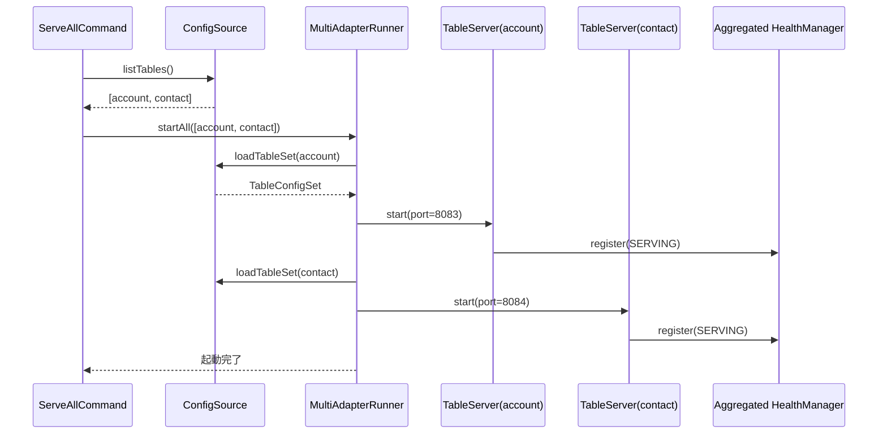

# フェーズ2-A: 複数テーブル運用支援の設計

| 項目 | 内容 |
|---|---|
| 作業タイトル | multi-table-support（フェーズ2-A） |
| 作成日 | 2026-05-22 |
| ステータス | ドラフト（承認待ち） |
| 親文書 | [requirements.md](requirements.md), [../../docs/functional-design.md](../../docs/functional-design.md) |

---

## 1. 設計の基本方針

### 1.1 全体アプローチ

- **後方互換維持**: フェーズ1 単一テーブル構成（`config/server.yaml` 等）も継続動作
- **コア層は再利用**: フェーズ1 で TDD 構築した `FilterTranslator` / `QueryBuilder` / `RowMapper` / `AdapterServiceImpl` 等は **テーブル毎にインスタンス化** して使う（コア変更なし）
- **多重起動の責務を MultiAdapterRunner に集約**: 既存の `ServeCommand` は薄いラッパに
- **`ConfigSource` 抽象化**: YAML 実装を分離し、後続フェーズで SQLite 等に切替可能に
- **TDD 継続**: 既存 121 テストは全緑維持。新規追加部分は同じ粒度でテスト

### 1.2 主要決定事項

| # | 決定事項 | 採用 | 理由 |
|---|---|---|---|
| D-01 | プロセスモデル | **A: 1 JVM 内マルチサーバ** | 単一テーブル < 500MB、リソース効率良、運用シンプル |
| D-02 | 設定ストア | YAML 継続（ConfigSource 抽象化） | requirements §11.1 で確定 |
| D-03 | ディレクトリ構造 | `config/tables/<name>/` + 共通 `config/jdbc/<datasource>.yaml`（オプション） | 個別テーブル設定と DRY な共通参照を両立 |
| D-04 | 後方互換 | フェーズ1 構成は `config/tables/default/` として自動マイグレート | 利用者の負担最小化 |
| D-05 | ポート採番 | `port: auto` で 8083 から空きポート連番 | 設定ミス回避 |
| D-06 | クラスローダー分離 | データソース毎に `URLClassLoader` を分離 | 複数 Driver の jar 競合回避 |
| D-07 | OAuth キャッシュ | `OAuthSettingsLocation` をテーブル別に自動展開 | データソース別に分離 |
| D-08 | プロセス監視 | フェーズ2-A では SHOULD（MT-21）として軽量実装 | systemd / supervisord は MUST にしない |

---

## 2. プロセスモデル: 1 JVM 内マルチサーバ

### 2.1 採用理由

```
┌──────────────────────────────────────────────────────────┐
│           JVM プロセス（cdata-kintone-adapter）              │
│                                                          │
│  ┌──────────────┐  ┌──────────────┐  ┌──────────────┐    │
│  │ AdapterServer│  │ AdapterServer│  │ AdapterServer│    │
│  │ table=account│  │ table=contact│  │ table=orders │    │
│  │ port: 8083   │  │ port: 8084   │  │ port: 8085   │    │
│  └──────┬───────┘  └──────┬───────┘  └──────┬───────┘    │
│         │                  │                  │           │
│         └──────────────────┴──────────────────┘           │
│                          │                                 │
│              ┌───────────▼────────────┐                   │
│              │ MultiAdapterRunner      │                   │
│              │ ・起動・停止管理         │                   │
│              │ ・ヘルスチェック統合     │                   │
│              │ ・シャットダウンフック   │                   │
│              └─────────────────────────┘                   │
└──────────────────────────────────────────────────────────┘
```

### 2.2 メリット・デメリット

| メリット | デメリット |
|---|---|
| リソース効率（1 JVM の起動コスト 1 回のみ） | 1テーブルの致命的バグで全停止リスク |
| ヘルスチェック統合が容易 | クラッシュ独立性が無い |
| ログ集約が容易 | JVM heap 上限の見積もり要 |

### 2.3 リスク緩和

- **CData JDBC Driver は JDBC Driver as a Service と理解**: 例外は適切に try-catch で握り、サーバ層には伝播させない
- **`AdapterServiceImpl` の catch-all**: 既にフェーズ1 で `Status.INTERNAL` でラップ済み
- **JVM heap 設定**: `-Xmx` を環境変数化（`ADAPTER_JVM_OPTS`）
- **将来の独立プロセス化への移行性**: `MultiAdapterRunner` の責務を limit すれば、後で別プロセスモデルへの切替も可能

---

## 3. `ConfigSource` 抽象化

### 3.1 インターフェース定義

```kotlin
package com.cdata.kintone.adapter.config

/**
 * 設定の永続化レイヤを抽象化する。
 *
 * フェーズ2-A では `YamlConfigSource` のみ実装。
 * フェーズ2-B（Web UI 導入時）に `SqliteConfigSource` を追加予定（requirements §11.1）。
 */
interface ConfigSource {
    /** 登録されている全テーブル名を返す */
    fun listTables(): List<String>

    /** 指定テーブルの全設定をロードする */
    fun loadTableSet(tableName: String): TableConfigSet

    /** テーブル設定を保存する（init-table から呼ばれる） */
    fun saveTableSet(tableName: String, set: TableConfigSet)

    /** テーブルを削除する */
    fun deleteTable(tableName: String)

    /** 共通 JDBC 設定を別名で取得（jdbc-ref 解決用） */
    fun loadSharedJdbcConfig(name: String): JdbcConfig?
}

/** 1 テーブル分の設定セット */
data class TableConfigSet(
    val server: ServerConfig,
    val jdbc: JdbcConfig,
    val table: TableConfig,
    val capability: CapabilityConfig,
)
```

### 3.2 `YamlConfigSource` 実装

```kotlin
class YamlConfigSource(
    private val configDir: Path,
    private val envResolver: (String) -> String? = System::getenv,
) : ConfigSource {
    override fun listTables(): List<String> =
        Files.list(configDir.resolve("tables"))
            .filter { Files.isDirectory(it) }
            .map { it.fileName.toString() }
            .sorted()
            .toList()

    override fun loadTableSet(tableName: String): TableConfigSet {
        val tableDir = configDir.resolve("tables/$tableName")
        val server = loadOne<ServerConfig>(tableDir.resolve("server.yaml"))
        val jdbc = resolveJdbc(tableDir)
        val table = loadOne<TableConfig>(tableDir.resolve("table.yaml"))
        val capability = loadOne<CapabilityConfig>(tableDir.resolve("capability.yaml"))
        return TableConfigSet(server, jdbc, table, capability)
    }

    /** jdbc.yaml があれば直接読み込み、jdbc-ref があれば共通設定を参照 */
    private fun resolveJdbc(tableDir: Path): JdbcConfig {
        val individual = tableDir.resolve("jdbc.yaml")
        if (Files.exists(individual)) return loadOne(individual)
        val refFile = tableDir.resolve("jdbc-ref.yaml")
        if (Files.exists(refFile)) {
            val ref = loadOne<JdbcRef>(refFile)
            return loadSharedJdbcConfig(ref.name)
                ?: throw ConfigParseException("共通 JDBC 設定が見つかりません: ${ref.name}")
        }
        throw ConfigFileMissingException("jdbc.yaml も jdbc-ref.yaml もありません: $tableDir")
    }

    override fun loadSharedJdbcConfig(name: String): JdbcConfig? {
        val path = configDir.resolve("jdbc/$name.yaml")
        return if (Files.exists(path)) loadOne<JdbcConfig>(path) else null
    }

    // saveTableSet / deleteTable / loadOne は省略
}

@Serializable
data class JdbcRef(val name: String)
```

### 3.3 後続フェーズで追加予定

```kotlin
// フェーズ2-B で追加
class SqliteConfigSource(
    private val dbFile: Path,
) : ConfigSource { ... }

// Hybrid 案（将来検討）
class HybridConfigSource(
    private val primary: ConfigSource,  // SQLite
    private val backup: ConfigSource,   // YAML
) : ConfigSource { ... }
```

---

## 4. 設定ディレクトリ構造

### 4.1 推奨レイアウト

```
config/
├ jdbc/                                  # 共通 JDBC 設定（オプション、DRY 用）
│  ├ salesforce.yaml                     # データソース毎の接続情報
│  └ googlesheets.yaml
│
├ tables/                                # テーブル別設定
│  ├ account/                            # 1 テーブル = 1 ディレクトリ
│  │  ├ server.yaml                      # ポート設定（省略時 auto）
│  │  ├ jdbc-ref.yaml                    # 共通 jdbc 参照（または jdbc.yaml で個別指定）
│  │  ├ table.yaml                       # テーブル名・カラム定義
│  │  └ capability.yaml                  # サポート機能宣言
│  │
│  ├ contact/
│  │  ├ server.yaml
│  │  ├ jdbc-ref.yaml                    # → jdbc/salesforce.yaml を参照
│  │  ├ table.yaml
│  │  └ capability.yaml
│  │
│  └ googlesheets-orders/
│     ├ server.yaml
│     ├ jdbc.yaml                        # こちらは個別 jdbc 設定（DRY なし）
│     ├ table.yaml
│     └ capability.yaml
```

### 4.2 各ファイルの具体例

**`config/jdbc/salesforce.yaml`**（共通設定）
```yaml
driver-class: cdata.jdbc.salesforce.SalesforceDriver
driver-jar: ./lib/cdata.jdbc.salesforce.jar
url: "jdbc:salesforce:AuthScheme=OAuth;InitiateOAuth=GETANDREFRESH;LoginURL=https://${SF_DOMAIN}/;OAuthSettingsLocation=./lib/oauth/salesforce.txt;"
pool:
  maximum-pool-size: 10
  connection-timeout: 30000
```

**`config/tables/account/server.yaml`**
```yaml
port: auto              # 自動採番（8083 から）
bind-address: 0.0.0.0
plaintext: true
```

**`config/tables/account/jdbc-ref.yaml`**
```yaml
name: salesforce        # config/jdbc/salesforce.yaml を参照
```

**`config/tables/account/table.yaml`**（フェーズ1 と同じフォーマット）
```yaml
name: Account
primary-key:
  kintone-field-id: id
  jdbc-column: Id
columns:
  - kintone-field-id: name
    jdbc-column: Name
    type: TEXT
  ...
```

**`config/tables/account/capability.yaml`**（フェーズ1 と同じフォーマット）

### 4.3 OAuth キャッシュの自動分離

複数ドライバー混在時、`OAuthSettingsLocation` を以下の規則で自動展開：

| 指定形式 | 解釈 |
|---|---|
| `./lib/oauth/salesforce.txt` | データソース別の共通 OAuth キャッシュ（共通 jdbc-ref 使用時） |
| 個別 jdbc.yaml で固定パス指定 | そのテーブル専用キャッシュ |
| **省略時** | `${configDir}/oauth/${tableName}.txt` を自動使用 |

---

## 5. 複数 Adapter プロセス管理

### 5.1 起動シーケンス



### 5.2 主要クラス

```kotlin
package com.cdata.kintone.adapter.runtime

/**
 * 1 テーブル分の Adapter サーバを担う。
 * 既存の AdapterServiceImpl + gRPC Server をラップ。
 */
class TableAdapterServer(
    private val tableName: String,
    private val configSet: TableConfigSet,
) : AutoCloseable {
    private val provider: JdbcConnectionProvider = JdbcConnectionProvider(configSet.jdbc)
    private val service: AdapterServiceImpl = AdapterServiceImpl(...)
    private lateinit var server: Server
    val port: Int get() = server.port
    val healthService: HealthStatusManager = HealthStatusManager()

    fun start(requestedPort: Int) { /* gRPC Server 起動 */ }

    override fun close() {
        server.shutdown()
        provider.close()
    }
}

/**
 * 複数 Adapter のライフサイクルを統合管理。
 */
class MultiAdapterRunner(
    private val configSource: ConfigSource,
    private val portAllocator: PortAllocator = PortAllocator(startFrom = 8083),
) : AutoCloseable {
    private val servers: MutableMap<String, TableAdapterServer> = ConcurrentHashMap()

    fun startAll(filter: List<String>? = null) {
        val tables = filter ?: configSource.listTables()
        for (tableName in tables) {
            startOne(tableName)
        }
    }

    fun startOne(tableName: String) {
        val configSet = configSource.loadTableSet(tableName)
        val port = configSet.server.port.takeIf { it > 0 } ?: portAllocator.next()
        val s = TableAdapterServer(tableName, configSet).apply { start(port) }
        servers[tableName] = s
    }

    fun stopOne(tableName: String) {
        servers.remove(tableName)?.close()
    }

    /** 全テーブルの状態を返す（list-active 用） */
    fun listActive(): List<AdapterStatus> = servers.values.map {
        AdapterStatus(tableName = it.tableName, port = it.port, status = "SERVING")
    }

    override fun close() {
        servers.values.forEach { it.close() }
        servers.clear()
    }
}

class PortAllocator(startFrom: Int = 8083) {
    private val used = mutableSetOf<Int>()
    private var next = startFrom
    fun next(): Int { /* 空きポート発見ロジック */ }
    fun reserve(port: Int) { used.add(port) }
}

data class AdapterStatus(
    val tableName: String,
    val port: Int,
    val status: String,
)
```

### 5.3 既存実装との統合

- `ServeCommand`（フェーズ1）→ 後方互換ラッパとして残し、内部で `MultiAdapterRunner.startOne("default")` を呼ぶ
- `ServeAllCommand`（新規）→ `MultiAdapterRunner.startAll()`
- `ListActiveCommand`（新規）→ 別 JVM 経由ではなく、稼働中 Runner の REST/gRPC マネジメントAPI？
  - **判断**: フェーズ2-A では **JMX 経由 or 管理用ヘルスエンドポイント** で実装（単純）
  - 詳細は §7

---

## 6. 複数ドライバー混在のクラスローダー戦略

### 6.1 課題

フェーズ1 の `JdbcConnectionProvider.loadDriver()` は **シングル URLClassLoader** で動作。
複数ドライバー混在時、以下の懸念：

- 同一 JVM 内で複数 Driver jar が classpath に並ぶ → JAR 間でのクラス衝突
- 各 Driver の `lib/` ライブラリ依存（特に bundled native libs）の干渉
- CData の license check ロジックが他 Driver の存在を誤認識

### 6.2 設計方針

```kotlin
class JdbcConnectionProvider(private val config: JdbcConfig) : AutoCloseable {
    private val classLoader: URLClassLoader = URLClassLoader(
        arrayOf(Path.of(config.driverJar).toUri().toURL()),
        ClassLoader.getPlatformClassLoader(),  // 親クラスローダを Platform に限定（隔離強化）
    )

    init {
        // DriverManager に直接登録するのではなく、HikariCP の driverClassName を介す
        // または、Driver インスタンスをコンテキストごとに保持する Shim パターン
    }
}
```

実装パターン候補：

| パターン | 内容 | 採用 |
|---|---|---|
| A. 親 classloader 分離 | 各 Driver を別 `URLClassLoader` で（parent=Platform） | △ Driver 内部の依存リーク確認要 |
| B. DriverShim パターン | フェーズ1 で導入済み。各 Driver で別 Shim を登録 | ◎ 既存実装の延長 |
| C. プロセス分離 | Driver 毎に別 JVM | × プロセスモデル A の方針と矛盾 |

**採用: B（DriverShim 拡張）** + A の併用検討。テストでドライバー混在動作を確認。

### 6.3 検証ポイント

- `cdata.jdbc.salesforce.jar` + `cdata.jdbc.googlesheets.jar` を同時 lib/ 配置
- 各々の license ファイル (`*.lic`) が正しく認識されるか
- OAuth キャッシュ (`OAuthSettingsLocation`) が別パスに分離されているか
- スレッドコンテキストクラスローダ起因のバグが出ないか

---

## 7. CLI コマンド設計

### 7.1 サブコマンド一覧

| サブコマンド | 説明 | フェーズ |
|---|---|---|
| `serve` | 単一テーブル起動（後方互換、内部で `startOne("default")`） | 既存 |
| `serve-all` | 設定された全テーブルを並列起動 | **新規** |
| `serve --table <name>` | 指定テーブルのみ起動 | **新規** |
| `serve --tables <name1>,<name2>` | 複数指定 | **新規** |
| `list-tables` | 接続先 DB のテーブル一覧（既存） | 既存 |
| `list-active` | 稼働中の Adapter 一覧 | **新規** |
| `test-connection` | JDBC 接続テスト（既存） | 既存 |
| `init-table` | 対話式 table.yaml 生成（既存）。引数 `--table <name>` で出力先テーブル名指定 | 拡張 |

### 7.2 後方互換ポリシー

| フェーズ1 構成 | フェーズ2-A での扱い |
|---|---|
| `config/server.yaml` 等が直接配置 | 起動時に **自動マイグレーション**: `config/tables/default/` 配下に移動（または同居サポート） |
| `adapter serve` | そのまま動く（内部で `default` テーブルとして扱う） |
| `adapter init-table` | デフォルト出力先は `config/tables/default/table.yaml` |

### 7.3 `serve-all` 実装スケッチ

```kotlin
class ServeAllCommand : CliktCommand(name = "serve-all") {
    private val configDir by option("--config-dir").path().default(Path.of("./config"))

    override fun run() {
        val source = YamlConfigSource(configDir)
        val runner = MultiAdapterRunner(source)
        runner.startAll()
        echo("Started ${runner.listActive().size} table(s):")
        runner.listActive().forEach { echo("  - ${it.tableName} (port=${it.port})") }
        Runtime.getRuntime().addShutdownHook(Thread { runner.close() })
        // ブロックしてシグナル待ち
        Thread.currentThread().join()
    }
}
```

### 7.4 `list-active` の実装方針

稼働中の Adapter プロセスに**管理ポート経由でクエリ** する案：

- `MultiAdapterRunner` が管理用 gRPC サービスを別ポート（例: 8000）で expose
- `list-active` は管理ポートに gRPC で問い合わせ

または **PID file / Unix Domain Socket** で管理：

| 案 | 内容 |
|---|---|
| A. 管理用 gRPC ポート | 既存 grpc-java 資産活用、簡単 |
| B. PID ファイル + ps コマンド | OS 依存、複雑 |
| C. JMX | Java の世界では正統だが、外部依存大 |

**採用: A（管理用 gRPC）**。各 TableAdapterServer がヘルスチェックエンドポイントを公開しているので、それを束ねる管理エンドポイントを別ポートで提供。

---

## 8. 複数 Agent コンテナ管理（Docker Compose）

### 8.1 docker-compose.yml 構造

```yaml
services:
  # 各テーブル用 Agent
  kintone-agent-account:
    build:
      context: .
      dockerfile: Dockerfile
    image: kintone-data-connector-agent:0.9.2
    container_name: kintone-agent-account
    extra_hosts: ["host.docker.internal:host-gateway"]
    volumes:
      - ./tables/account/agent.json:/opt/agent/agent.json:ro
      - ./private-key.pem:/opt/agent/private-key.pem:ro  # 全テーブルで共有 (MT-12)
    restart: unless-stopped

  kintone-agent-contact:
    image: kintone-data-connector-agent:0.9.2
    container_name: kintone-agent-contact
    extra_hosts: ["host.docker.internal:host-gateway"]
    volumes:
      - ./tables/contact/agent.json:/opt/agent/agent.json:ro
      - ./private-key.pem:/opt/agent/private-key.pem:ro
    restart: unless-stopped
```

### 8.2 ディレクトリ構造の更新

```
agent/
├ Dockerfile
├ docker-compose.yml                # 全テーブル分の Agent サービス
├ private-key.pem                   # 全 Agent で共有（gitignore）
├ public-key.pem                    # kintone 登録用（参考、gitignore 任意）
├ tables/
│  ├ account/
│  │  └ agent.json                  # token + adapter_addr (host.docker.internal:8083 等)
│  ├ contact/
│  │  └ agent.json                  # token + adapter_addr (host.docker.internal:8084)
│  └ googlesheets-orders/
│     └ agent.json
└ README.md
```

### 8.3 自動生成オプション（将来検討）

`adapter generate-compose` のようなコマンドで、稼働中 Adapter から `docker-compose.yml` のサービス定義を自動生成。
**フェーズ2-A では手動編集** とする（自動生成はフェーズ2-B の Web UI で実装）。

---

## 9. データ構造の追加・変更

### 9.1 新規データクラス

```kotlin
// config パッケージ
data class TableConfigSet(
    val server: ServerConfig,
    val jdbc: JdbcConfig,
    val table: TableConfig,
    val capability: CapabilityConfig,
)

@Serializable
data class JdbcRef(val name: String)

// runtime パッケージ（新設）
data class AdapterStatus(
    val tableName: String,
    val port: Int,
    val status: String,
    val startedAt: Instant,
)
```

### 9.2 既存データクラスの変更

| クラス | 変更 |
|---|---|
| `ServerConfig` | `port: Int` → `port: Int = 0` （0 = auto） |
| `AdapterConfig` | テーブル単位の `TableConfigSet` に統合（後方互換のため alias 残す） |
| `ConfigLoader` | `ConfigSource` インターフェースの実装にリファクタ（保持関数で互換性） |

---

## 10. テスト戦略

### 10.1 後方互換性テスト（最重要）

- 既存 121 テストを全緑のまま維持
- フェーズ1 構成（`config/server.yaml` 等が直接配置）で起動して動作確認

### 10.2 新規テスト

| クラス | テスト数（目安） |
|---|---|
| `YamlConfigSource` | 10（共通 jdbc 参照・個別 jdbc・テーブル一覧 等） |
| `MultiAdapterRunner` | 8（起動・停止・複数同時・グレースフル） |
| `PortAllocator` | 5（空きポート発見・予約・競合） |
| `ConfigSourceInterface` | 共通契約テスト |
| 統合テスト | H2 で 2 テーブル並列起動・別ポート確認 |

### 10.3 E2E 検証

- requirements §7 シナリオ S-01 〜 S-12 を実施
- 特に S-11（複数ドライバー混在）と S-12（鍵共有確認）

---

## 11. リスクと対応

| # | リスク | 対応 |
|---|---|---|
| R-A | 1 JVM で 5+ テーブル並列時のメモリ問題 | `-Xmx` 設定の調整指針を README に記載 |
| R-B | 1 テーブルの致命的バグで全停止 | `AdapterServiceImpl` の catch-all + 個別再起動 API |
| R-C | 既存 121 テストの後方互換性破壊 | リファクタリング前にテスト一式パスを git tag、段階的に変更 |
| R-D | `ConfigSource` API の将来 SQLite 実装で齟齬 | フェーズ2-B 着手時に再評価ポイントを記録（§3.3） |
| R-E | 複数 OAuth キャッシュの初期化フロー | `init-table` 実行時に OAuthSettingsLocation を必ず明示・分離 |
| R-F | Docker Compose の Agent コンテナがリソース圧迫 | 単一 Agent コンテナで複数 Adapter を見る案も検討（要検証） |

---

## 12. 影響範囲

### 12.1 既存資産への影響

- ❌ **破壊的変更なし**: フェーズ1 のコア層（filter/jdbc/service/metadata）はそのまま
- ⚠️ **設定読込ロジック変更**: `ConfigLoader` → `ConfigSource` リファクタ
- ⚠️ **CLI コマンドの追加**: 既存コマンドはシグネチャ変更なし
- ✅ **ドキュメント更新**: README / docs/functional-design.md 等を更新

### 12.2 新規追加

- `src/main/kotlin/com/cdata/kintone/adapter/config/ConfigSource.kt`
- `src/main/kotlin/com/cdata/kintone/adapter/config/YamlConfigSource.kt`
- `src/main/kotlin/com/cdata/kintone/adapter/runtime/MultiAdapterRunner.kt`
- `src/main/kotlin/com/cdata/kintone/adapter/runtime/TableAdapterServer.kt`
- `src/main/kotlin/com/cdata/kintone/adapter/runtime/PortAllocator.kt`
- `src/main/kotlin/com/cdata/kintone/adapter/cli/ServeAllCommand.kt`
- `src/main/kotlin/com/cdata/kintone/adapter/cli/ListActiveCommand.kt`
- 各々の単体テスト
- `config/jdbc/salesforce.yaml.example`
- `config/tables/<name>/*.yaml.example`
- `agent/docker-compose.yml`（複数サービス対応版）

---

## 13. マイグレーション設計

### 13.1 フェーズ1 構成からの自動移行

起動時に以下を検出：

```
config/
├ server.yaml          ← フェーズ1 配置
├ jdbc.yaml            ← フェーズ1 配置
├ table.yaml           ← フェーズ1 配置
└ capability.yaml      ← フェーズ1 配置
```

ConfigSource は **「フェーズ1 配置 = default テーブル」として透過的に扱う**：

- `listTables()` → `["default"]`
- `loadTableSet("default")` → 既存 4 ファイルから読込

これにより、フェーズ1 ユーザーが何も変更せずにフェーズ2-A を導入できる。

### 13.2 明示的移行コマンド（任意）

```bash
adapter migrate-config
# config/server.yaml etc → config/tables/default/ へ移動
```

---

## 14. 関連ドキュメント

- 要件：[requirements.md](requirements.md)
- タスクリスト：[tasklist.md](tasklist.md)（design 承認後に作成）
- フェーズ1 設計：[../20260515-initial-implementation/design.md](../20260515-initial-implementation/design.md)
- 機能設計（永続）：[../../docs/functional-design.md](../../docs/functional-design.md)
