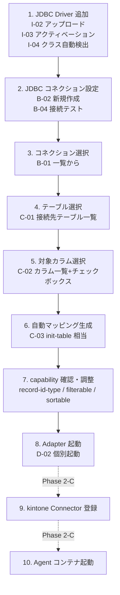

# Phase 2-B: Web UI + SqliteConfigSource + Salesforce 新階層移行 — 要求定義

| 項目 | 内容 |
|---|---|
| フェーズ | 2-B |
| 作成日 | 2026-05-22 |
| 前提 | Phase 2-A (v0.2.1-quoted-identifiers) 完了済み |
| 目的 | YAML 直編集に代わる設定 UI を最小版で提供し、SQLite ベースに段階移行する |

## 1. 背景と狙い

Phase 2-A で マルチテーブル運用が可能になったが、設定は YAML 直編集が必須で、
非開発者が運用するには敷居が高い。また YAML は構造的検証が弱く、誤設定で
Adapter が起動失敗するケースもある。

Phase 2-B では以下 3 つを並行で進める:

1. **Web UI 最小版**: ブラウザからテーブル CRUD・Adapter 起動/停止
2. **SqliteConfigSource 実装**: ConfigSource 抽象の SQLite 実装。`YamlConfigSource` と
   並行運用可能にし、Web UI からの読み書きを安全 (ACID) に行う基盤
3. **Salesforce を新階層に移行**: Phase 1 互換 (`config/server.yaml` 直下) で動いている
   Salesforce 設定を `config/tables/account/` に移し、`serve-all` 一括起動を可能にする

## 2. スコープ外（次フェーズ送り）

- TLS 終端 (`plaintext: false` 化)
- 認証 (Web UI のログイン機構)
- 外部 DB (PostgreSQL/MySQL) ConfigSource
- Helm Chart / Kubernetes Manifest
- CData Connect AI 連携
- マルチホスト分散運用

## 3. 機能要件

### 3.1 Web UI 全体像と Phase 2-B スコープ切り出し

> **整理方針**: Web UI として最終的に欲しい機能を A〜H で網羅し、それぞれフェーズに割り付ける。
> Phase 2-B では「最小で実運用できる」線を採用し、運用補助・認証・監査は次フェーズ送り。

#### A. テーブル管理

| ID | 機能 | フェーズ |
|---|---|---|
| A-01 | テーブル一覧（検索・絞り込み） | **2-B** |
| A-02 | テーブル詳細表示（4 設定セクション） | **2-B** |
| A-03 | テーブル新規作成（ウィザード式） | **2-B** |
| A-04 | テーブル編集（個別フィールド） | **2-B** |
| A-05 | テーブル削除 | **2-B** |
| A-06 | テーブル複製（既存設定をコピーして新テーブル化） | 2-C |
| A-07 | YAML インポート/エクスポート | 2-C |

#### B. 共通 JDBC 接続設定管理

| ID | 機能 | フェーズ |
|---|---|---|
| B-01 | 共通 JDBC 設定一覧 | **2-B** |
| B-02 | 共通 JDBC 設定 新規作成 | **2-B** |
| B-03 | 共通 JDBC 設定 編集 | **2-B** |
| B-04 | 接続テスト（test-connection 相当） | **2-B** |
| B-05 | OAuth 認証フロー起動（CData 埋め込み OAuth トリガ） | 2-C |
| B-06 | 環境変数プレースホルダの可視化（`${SF_USER}` 等） | **2-B** |
| B-07 | ドライバ接続プロパティの動的一覧取得（`sys_connection_props` 経由）と入力フォーム自動生成 | **2-B** |
| B-08 | プロパティ入力値から JDBC URL を自動生成 | **2-B** |

#### C. メタデータ参照（接続先 DB の探索）

| ID | 機能 | フェーズ |
|---|---|---|
| C-01 | 接続先のスキーマ/テーブル一覧表示（list-tables 相当） | **2-B** |
| C-02 | 選択テーブルのカラム一覧（JDBC ResultSetMetaData） | **2-B** |
| C-03 | 自動カラムマッピング生成（init-table 相当） | **2-B** |
| C-04 | SELECTION 候補値の DB 自動検出 | 2-C |

#### D. ランタイム制御

| ID | 機能 | フェーズ |
|---|---|---|
| D-01 | 稼働中 Adapter 一覧（active-adapters.json polling） | **2-B** |
| D-02 | テーブル個別の起動/停止ボタン | **2-B** |
| D-03 | ヘルスチェック表示（grpc.health.v1） | **2-B** |
| D-04 | 設定変更後の再起動ボタン（設定編集画面から1クリック） | **2-B** |
| D-05 | 全 Adapter の一括起動/停止 | 2-C |
| D-06 | Adapter プロセスのリソース使用量表示 | 2-D |

#### E. kintone Connector / Agent 統合

| ID | 機能 | フェーズ |
|---|---|---|
| E-01 | Connector 情報（token プレースホルダ、agent_addr）編集 | 2-C |
| E-02 | 公開鍵ダウンロード（登録用） | 2-C |
| E-03 | Agent docker-compose スニペット自動生成 | 2-C |
| E-04 | kintone Connector 登録手順の Web ガイド | 2-C |
| E-05 | Agent コンテナの起動/停止操作 | 2-C |

#### F. 監視・ログ

| ID | 機能 | フェーズ |
|---|---|---|
| F-01 | Adapter プロセスログのライブテール | 2-C |
| F-02 | Agent コンテナログのライブテール | 2-C |
| F-03 | RPC 呼び出し統計（件数・レイテンシ） | 2-D |
| F-04 | エラー監視・通知 | 2-D |

#### G. 認証・権限

| ID | 機能 | フェーズ |
|---|---|---|
| G-01 | ローカル（127.0.0.1）のみ listen | **2-B** デフォルト |
| G-02 | Basic 認証 | 2-D |
| G-03 | OIDC / SAML 認証 | 2-D |
| G-04 | ロールベース権限 | 2-D |

#### H. 運用・バックアップ

| ID | 機能 | フェーズ |
|---|---|---|
| H-01 | 設定エクスポート（全 YAML / SQLite snapshot） | 2-C |
| H-02 | 設定インポート（復元） | 2-C |
| H-03 | 監査ログ | 2-D |
| H-04 | 多人数同時編集ロック / 楽観ロック | 2-D |

#### I. JDBC Driver 管理

| ID | 機能 | フェーズ |
|---|---|---|
| I-01 | 配置済み Driver JAR 一覧（lib/ スキャン、クラス名・ライセンス状態） | **2-B** |
| I-02 | JAR ファイルのアップロード（ブラウザから lib/ に保存） | **2-B** |
| I-03 | トライアルアクティベーション（名前/メール UI 入力 → `.lic` 保存） | **2-B** |
| I-04 | ドライバクラス自動検出（META-INF/services/java.sql.Driver） | **2-B** |
| I-05 | Driver 削除 | **2-B** |
| I-06 | 製品コードから自動ダウンロード（setup-cdata-jdbc スキル相当を Web 化） | 2-C |
| I-07 | Driver バージョン管理（複数バージョン併存・切り替え） | 2-D |

### 3.2 ユーザージャーニー（新規テーブル登録の完成形）

Phase 2-B 完了時に Web UI から実現できる、**ゼロから新しいテーブルを kintone と連携するまで** の標準フロー。
各ステップで使用する機能 ID と画面遷移を明記。

#### ステップ詳細

| # | ステップ | 画面 / アクション | 機能 ID | 補足 |
|---|---|---|---|---|
| 1 | JDBC Driver 追加 | `/drivers` で「JAR アップロード」→ アクティベーション | I-02, I-03, I-04 | 既配置 driver があればスキップ可 |
| 2 | JDBC コネクション設定 | `/connections/new` で接続情報入力 → 接続テスト | B-02, B-04 | 機密値は環境変数プレースホルダで保護 (B-06) |
| 3 | コネクション選択 | `/tables/new` ウィザード 1/4 でドロップダウン選択 | B-01 | jdbc-ref の `name` がここで決まる |
| 4 | テーブル選択 | ウィザード 2/4 で接続先 DB のテーブル一覧表示 → 選択 | C-01 | list-tables 相当を内部で実行 |
| 5 | カラム選択 | ウィザード 3/4 で全カラム表示 → 連携対象のみチェック | C-02 | デフォルトは全カラム選択 |
| 6 | 自動マッピング生成 | ウィザード 4/4 で kintone field_id・型を自動提案 → 微調整 | C-03 | init-table 相当。snake_case 変換、ColumnType 推奨 |
| 7 | capability 確認 | 同 4/4 内で record-id-type 等の表示・調整 | A-03 の一部 | 主キー型から自動推奨 (NUMBER/TEXT) |
| 8 | Adapter 起動 | テーブル詳細画面の「起動」ボタン | D-02 | 起動成功で `active-adapters.json` に登録、port 表示 |
| 9 | kintone Connector 登録 | （Phase 2-C 機能）E-01〜E-04 でガイド | E-01〜E-04 | 2-B では手順書 [e2e-checklist.md](../20260522-multi-table-support/e2e-checklist.md) を参照 |
| 10 | Agent 起動 | （Phase 2-C 機能）docker-compose スニペット生成・起動 | E-03, E-05 | 2-B では手動 |

#### 既存テーブル編集の流れ

| # | アクション | 画面 | 機能 ID |
|---|---|---|---|
| 1 | テーブル一覧から選択 | `/tables` | A-01 |
| 2 | 設定を編集 | `/tables/<name>/edit`（4 セクション: server / jdbc-ref / table / capability） | A-04 |
| 3 | 保存 → 再起動 | 「保存して再起動」ボタン | A-04, D-04 |

#### 削除の流れ

| # | アクション | 画面 | 機能 ID |
|---|---|---|---|
| 1 | テーブル詳細から「削除」 | `/tables/<name>` | A-05 |
| 2 | 確認ダイアログ → 削除 | モーダル | A-05 |
| 3 | 稼働中 Adapter があれば自動停止 | 内部処理 | D-02 (stop) |

### 3.3 Phase 2-B 採用機能のまとめ (= "最小で運用可能" の線)

合計 **23 機能** を Phase 2-B で実装:

| カテゴリ | 件数 | 機能 ID |
|---|---|---|
| A. テーブル管理 | 5 | A-01〜A-05 |
| B. 共通 JDBC 設定 | 7 | B-01〜B-04, B-06〜B-08 |
| C. メタデータ参照 | 3 | C-01〜C-03 |
| D. ランタイム制御 | 4 | D-01〜D-04 |
| G. 認証 | 1 | G-01 (デフォルト) |
| I. JDBC Driver 管理 | 5 | I-01〜I-05 |

**カバー範囲の根拠**:
- A+B+C+**I**: 「YAML 直編集 + 手動 driver 配置と同等のことをブラウザでできる」状態
- D: 「設定後そのまま起動・停止できる」状態
- E は Phase 2-C で「kintone Connector 登録までガイドする」状態を目指す
- F/G/H は運用規模が大きくなってから（Phase 2-D / 3）

**Phase 2-B 完了時の「ノー CLI」運用例**:

1. Web UI を開く（`localhost:8080`）
2. Driver 管理画面で Salesforce JDBC JAR をアップロード → トライアルアクティベーション
3. 共通 JDBC 設定で Salesforce 接続情報を登録 → 接続テスト
4. テーブル新規作成で接続先テーブルを選択 → カラム自動マッピング → 保存
5. テーブル詳細画面の「起動」ボタンで Adapter プロセス開始
6. （別途）kintone 側で Connector 登録 + Agent 起動（Phase 2-C で UI 化）

### 3.2 SqliteConfigSource

優先度: 🟡 中

| ID | 機能 | 受け入れ条件 |
|---|---|---|
| SQ-01 | YamlConfigSource と同一インターフェース | `ConfigSource` を実装。既存の MultiAdapterRunner / CLI から差し替え可 |
| SQ-02 | スキーマ初期化 | SQLite DB がなければ自動作成（テーブル: tables, jdbcs, jdbc_refs） |
| SQ-03 | YAML → SQLite 移行コマンド | `adapter migrate-to-sqlite` で既存 YAML を一括取り込み |
| SQ-04 | SQLite → YAML エクスポート | `adapter export-yaml` で SQLite から YAML を出力（バックアップ用） |
| SQ-05 | デフォルト切り替え | 環境変数 / CLI フラグで Yaml / Sqlite を選択可能 |

### 3.3 Salesforce 新階層移行

優先度: 🟡 中

| ID | 機能 | 受け入れ条件 |
|---|---|---|
| SF-01 | Salesforce を `config/tables/account/` に移行 | `migrate-config` 既存実装で完結 |
| SF-02 | jdbc-ref で共通設定参照 | `config/jdbc/salesforce.yaml` を作成し、tables/account から jdbc-ref で参照 |
| SF-03 | serve-all で Salesforce + gs-opportunity を一括起動 | 1 JVM 内で 2 ポートが共存 |
| SF-04 | 既存 kintone Connector / Agent との互換性維持 | port 8083 (Salesforce) で外部アプリが動作継続 |

## 4. 非機能要件

| ID | 種別 | 内容 |
|---|---|---|
| NFR-01 | 性能 | Web UI: 主要画面の応答 < 200ms (LAN 内) |
| NFR-02 | 性能 | SqliteConfigSource: listTables() < 50ms (100 テーブル想定) |
| NFR-03 | 信頼性 | SQLite WAL モードで並行書き込み安全性確保 |
| NFR-04 | 運用 | Web UI と Adapter は別プロセス（独立に起動・停止できる） |
| NFR-05 | 開発 | フェーズ2-A の 189 件テストは全て緑のまま維持 |
| NFR-06 | セキュリティ | Web UI はローカル (127.0.0.1) のみ listen がデフォルト。token 等の機密はマスク表示 |

## 5. 制約

- **言語**: 引き続き Kotlin
- **テスト戦略**: TDD（Red → Green → Refactor）を維持
- **後方互換**: YAML 設定で運用しているユーザは何も変更せず Phase 2-B 機能を**使わないでも**動き続ける
- **ライセンス**: 既存に揃える (Apache License 2.0)

## 6. 想定される技術スタック候補

正式選定は [design.md](./design.md) で行う。要求定義段階のラフ案:

| レイヤ | 候補 |
|---|---|
| Web サーバ | Ktor / Spring Boot WebFlux / javalin |
| UI レンダリング | HTMX + Kotlin HTML DSL / Vanilla JS / React (CRA) |
| SQLite ドライバ | xerial sqlite-jdbc / `org.sqlite:sqlite-jdbc` |
| マイグレーション | 手書き DDL / Flyway / Liquibase |

推奨初期案: **Ktor + HTMX + xerial sqlite-jdbc + 手書き DDL**（最小依存・最小学習コスト）

## 7. 受け入れシナリオ（design.md 確定後に具体化）

- **S-01**: Web UI から新規テーブル作成 → そのまま起動 → kintone 外部アプリ作成
- **S-02**: 既存テーブルの設定を Web UI で編集 → 再起動で反映
- **S-03**: `migrate-to-sqlite` で YAML → SQLite 一括移行 → Web UI で表示・編集
- **S-04**: SQLite モードで `serve-all` 起動 → YAML モードと同等に動作
- **S-05**: Salesforce を新階層に移行 → serve-all で Salesforce + Google Sheets が同時稼働
- **S-06**: 接続テスト失敗時のエラー表示が Web UI 上でわかりやすい

## 8. 関連

- Phase 2-A 設計: [../20260522-multi-table-support/design.md](../20260522-multi-table-support/design.md)
- Phase 2-A 既知の課題（解決済）: [../20260522-multi-table-support/known-issues.md](../20260522-multi-table-support/known-issues.md)
- ConfigSource 抽象: [src/main/kotlin/com/cdata/kintone/adapter/config/ConfigSource.kt](../../src/main/kotlin/com/cdata/kintone/adapter/config/ConfigSource.kt)
