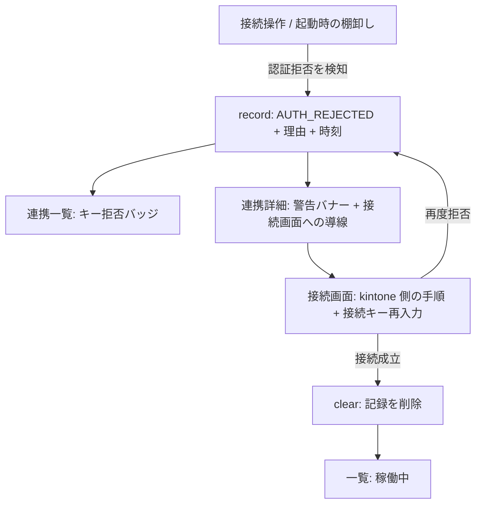

# 接続キー拒否からの復旧導線 — 設計

| 項目 | 内容 |
|---|---|
| 開発タイトル | auth-rejected-recovery |
| 対応 Issue | [#21](https://github.com/sugimomoto/KintoneExternalAppCDataSample/issues/21) |
| 作成日 | 2026-09-29 |
| 要求定義 | [requirements.md](requirements.md) |

---

## 1. 設計方針

### 1.1 主要な設計判断

| # | 判断 | 理由 | 却下した代替案 |
|---|---|---|---|
| D-1 | `Result` に **`AuthRejected`** を追加する | 認証拒否だけ案内を変える必要がある。`Failure(reason)` の文言で判定するのは壊れやすい（C-4, AC-11） | `Failure` に `recoverable: Boolean` を足す案 → 呼び出し側の `when` が網羅されない |
| D-2 | 記録は **`run/agent-connection-status.json`** に置く | 実行時状態なので `config.db` ではなく `run/` 配下。`ActiveAdaptersFile` と同じ流儀（C-2, F-4） | SQLite に状態テーブルを足す案 → 設定と実行時状態が混ざる |
| D-3 | 記録するのは **連携名・状態・理由・検知時刻**のみ | 接続キーを残さない（C-1, AC-4） | 失敗時のリクエスト内容を残す案 |
| D-4 | 記録の書き込みは **2 経路**から行う | 接続操作時と起動時の棚卸しの両方で検知される（F-3, AC-2） | 片方だけにする案 → もう一方の検知が画面に出ない |
| D-5 | 接続成功で記録を**消す** | 残すと復旧後も警告が出続ける（AC-3） | 履歴として残す案 → 現在の状態が読み取れない |
| D-6 | 読み取り失敗は**記録なし**として扱う | 補助情報のため画面を落とさない（C-3, AC-13） | 例外を伝播させる案 |
| D-7 | 一覧のバッジは記録があれば **「キー拒否」** にする | 「停止中」と区別する（AC-5）。#20 で追加した `failing`（危険色）を流用する | 別の列を足す案 → 列が増えすぎる |
| D-8 | kintone 側の手順は**画面に直接書き、ヘルプへリンクも張る** | 手順書を別に開かせない（AC-8）。文言はヘルプ画面を正とする（C-5, F-5） | ヘルプへのリンクだけ張る案 |

### 1.2 状態の流れ



---

## 2. 変更・追加するコンポーネント

| ファイル | 区分 | 内容 |
|---|---|---|
| `agent/AgentConnectionStatus.kt` | 新規 | 記録の値オブジェクト |
| `agent/AgentConnectionStatusStore.kt` | 新規 | `run/agent-connection-status.json` の読み書き |
| `agent/SyncConnectionService.kt` | 変更 | `Result.AuthRejected` を追加。拒否時に記録、成功時に削除 |
| `agent/AgentAuthFailureSweeper.kt` | 変更 | 停止時に記録する |
| `web/AppContext.kt` | 変更 | ストアを組み立てて公開 |
| `web/routes/ConnectKintoneRoutes.kt` | 変更 | `AuthRejected` を専用の案内で表示 |
| `web/views/ConnectKintoneView.kt` | 変更 | 認証拒否時に kintone 側の手順を出す |
| `web/views/TablesView.kt` | 変更 | 一覧バッジに「キー拒否」、詳細に警告バナーと導線 |

テスト:

| ファイル | 区分 | 内容 |
|---|---|---|
| `agent/AgentConnectionStatusStoreTest.kt` | 新規 | 読み書き・削除・ファイル不在・壊れたファイル |
| `agent/SyncConnectionServiceTest.kt` | 変更 | `AuthRejected` を返す・記録する・成功で消す |
| `agent/AgentAuthFailureSweeperTest.kt` | 変更 | 停止時に記録する |

---

## 3. データ構造

### 3.1 `AgentConnectionStatus`

```kotlin
/**
 * Agent の接続が失敗した記録。
 *
 * 接続キーは含めない。画面・ログに平文で出さない方針 (#10 / #16) を踏襲する。
 */
@Serializable
data class AgentConnectionStatus(
    val syncName: String,
    val state: State,
    /** 画面に出す理由。接続キーそのものは含めない。 */
    val reason: String,
    /** 検知時刻 (epoch millis)。 */
    val detectedAt: Long,
) {
    enum class State {
        /** 接続キーが kintone に拒否された。再試行では直らない。 */
        AUTH_REJECTED,
    }
}
```

`State` を enum にしているのは、将来ほかの恒久的な失敗を足せるようにするため。
いまは 1 値だけ。

### 3.2 `AgentConnectionStatusStore`

```kotlin
/**
 * Agent の接続失敗の記録を JSON ファイルで保持する。
 *
 * console を再起動しても残す必要がある。棚卸し (#19) は「直近のログ」で判定するため、
 * いったん停止したコンテナは次の起動時には検知されず、記録がないと理由が失われる。
 */
class AgentConnectionStatusStore(private val path: Path = DEFAULT_PATH) {

    fun record(status: AgentConnectionStatus)
    fun clear(syncName: String)
    fun get(syncName: String): AgentConnectionStatus?
    fun all(): Map<String, AgentConnectionStatus>

    companion object {
        val DEFAULT_PATH: Path = Path.of("./run/agent-connection-status.json")
    }
}
```

読み取りは失敗しても例外を投げず空として扱う（D-6）。

### 3.3 `Result.AuthRejected`

```kotlin
sealed class Result {
    data object Success : Result()
    data class Pending(val reason: String) : Result()
    data class Failure(val reason: String) : Result()

    /**
     * 接続キーが kintone に拒否された。再試行では直らないため、
     * Agent コンテナは停止済み (#19)。復旧には接続キーの再発行が必要。
     */
    data class AuthRejected(val reason: String) : Result()
}
```

`Failure` の一種ではなく並列の型にする。呼び出し側の `when` で網羅漏れをコンパイラに検出させる。

---

## 4. 実装

### 4.1 `SyncConnectionService`

| タイミング | 処理 |
|---|---|
| `AUTH_FAILED` | コンテナ停止（#19、既存）→ **記録** → `AuthRejected` を返す |
| `CONNECTED` | **記録を削除** → `Success` を返す |
| `TIMEOUT` | 変更なし（`Pending`） |

記録する理由の文言は画面に出るものと同一にする。

### 4.2 `AgentAuthFailureSweeper`

停止に成功した連携について記録する。`AgentConnectionStatusStore` を
コンストラクタで受け取る（テストで差し替えるため）。

### 4.3 連携一覧のバッジ

```kotlin
// 認証拒否で止まっている場合は「停止中」と区別する。
// 単に止めたのか、直す必要があるのかを一覧で判断できるようにする。
AgentContainerManager.State.STOPPED ->
    if (authRejected) {
        span(classes = "status-badge failing") { +"キー拒否" }
    } else {
        span(classes = "status-badge stopped") { +"停止中" }
    }
```

記録は `ctx.agentConnectionStatusStore.all()` で 1 回だけ読む（一覧は N+1 を避ける）。

### 4.4 連携詳細の警告バナー

`agentSection` の先頭に出す。

```
⚠ 接続キーが kintone に拒否されています (検知: 2026-09-29 13:50)
   kintone 側で接続キーを再発行し、入力し直してください。
   [kintone と接続 →]  [ヘルプを見る]
```

### 4.5 接続画面の案内

`connectKintoneView` に `authRejected: Boolean` を渡し、Step 2 の直前に手順を出す。

```
⚠ 接続キーが kintone に拒否されました

kintone 側の操作:
  1. kintone の「外部システムのアプリ化」を開く
  2. この連携に対応する接続を選ぶ
  3. 接続キーを再発行する
  4. 発行された接続キーを下の Step 2 に貼り付けて「接続して開始」

接続を作り直した場合、以前の接続キーは有効期限内でも拒否されます。
```

最後の一文は #19 の調査結果（署名も期限も有効なまま拒否される）を踏まえたもの。
「期限切れではないのに拒否される」理由が分からないと、利用者は原因を探し続けてしまう。

---

## 5. 影響範囲の分析

| 対象 | 影響 | 対応 |
|---|---|---|
| `ConnectKintoneRoutes` の `when (result)` | `AuthRejected` が増え網羅漏れになる | 専用の分岐を追加 |
| `SyncConnectionService` の既存テスト | `AUTH_FAILED` が `Failure` ではなく `AuthRejected` を返すようになる | 既存テストの期待値を更新（`トークン失効を検知したら即座に失敗を返す` など） |
| `TablesRoutes` / ほかの `Result` 利用箇所 | `connect` を呼ぶのは `ConnectKintoneRoutes` のみ | 確認して必要なら対応 |
| `run/` ディレクトリ | 新しい JSON ファイルが増える | `.gitignore` の対象か確認 |
| 一覧画面の表示速度 | ファイル読み取り 1 回 | 連携数に依存しない |

---

## 6. テスト設計

### 6.1 `AgentConnectionStatusStoreTest`

- 記録した内容を読み出せる
- 複数の連携を記録できる
- `clear` で 1 件だけ消える
- 記録が無い連携は null を返す
- ファイルが存在しないとき空を返す
- ファイルが壊れているとき空を返す（例外を投げない）
- 同じ連携を再記録すると上書きされる
- 記録に接続キーを含めない（`reason` に渡した文言だけが保存される）

### 6.2 `SyncConnectionServiceTest`（変更・追加）

- 認証拒否のとき `AuthRejected` を返す（既存テストの期待値を更新）
- 認証拒否のとき記録される
- 接続成功のとき記録が消える
- タイムアウトでは記録しない

### 6.3 `AgentAuthFailureSweeperTest`（追加）

- 停止した連携が記録される
- 停止しなかった連携は記録されない

### 6.4 手動確認

1. 一覧で Product / ProductPlant / bcartorders が「キー拒否」と表示される
   （#19 の棚卸しで停止された記録が残っている状態）
2. 連携詳細に警告バナーと導線が出る
3. 接続画面に kintone 側の手順が出る
4. 接続成功後に記録が消え、一覧が「稼働中」に戻る

---

## 7. 受け入れ条件との対応

| AC | 対応する設計 | 検証 |
|---|---|---|
| AC-1 | D-2 のファイル永続化 | §6.1 |
| AC-2 | D-4（2 経路） | §6.2, §6.3 |
| AC-3 | D-5 | §6.2 |
| AC-4 | D-3 | §6.1 |
| AC-5 | §4.3 | §6.4 |
| AC-6 | §4.4 | §6.4 |
| AC-7 | §4.4 の導線 | §6.4 |
| AC-8 | §4.5 + ヘルプへのリンク | §6.4 |
| AC-9 | F-1（既存の再描画）+ §4.5 | §6.4 |
| AC-10 | D-5 + §4.3 | §6.4 |
| AC-11 | D-1 `AuthRejected` | §6.2 |
| AC-12 | §6.1 | — |
| AC-13 | D-6 | §6.1 |
| AC-14 | — | `./gradlew test` |
