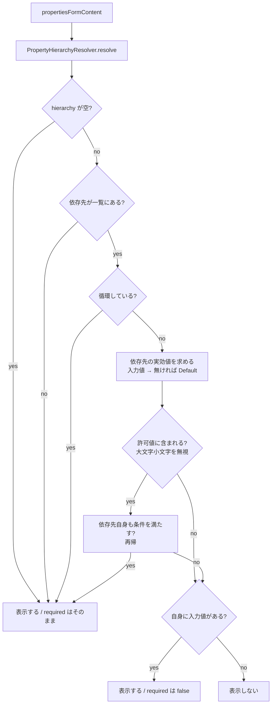

# 認証方式に応じた接続プロパティの動的制御 — 設計

| 項目 | 内容 |
|---|---|
| 開発タイトル | auth-scheme-aware-properties |
| 対応 Issue | [#14](https://github.com/sugimomoto/KintoneExternalAppCDataSample/issues/14) |
| 作成日 | 2026-09-29 |
| 要求定義 | [requirements.md](requirements.md) |

---

## 1. 設計方針

### 1.1 主要な設計判断

| # | 判断 | 理由 | 却下した代替案 |
|---|---|---|---|
| D-1 | 条件の評価は**サーバー側の純粋関数**で行い、htmx でフォームを差し替える | 再帰評価をクライアントと二重実装しない（C-1）。テストしやすい | `data-*` 属性 + JS でトグルする案 → 100 件超の再帰評価を JS 側に持つことになる |
| D-2 | 依存先の**実効値** = 入力値、無ければ `Default` | 初回表示（未入力）でも既定の認証方式で正しく絞り込める。`AuthScheme` は全ドライバーが既定値を持つ（F-6） | 未入力なら全件表示する案 → 初回表示が現状のまま改善されない |
| D-3 | 判定不能（依存先が一覧に無い・形式不正・循環）は**「条件を満たす」**扱い | 非表示に倒すとドライバー更新で画面が空になり得る（C-2, C-3） | 判定不能を非表示にする案 |
| D-4 | **値を持つプロパティは条件を満たさなくても表示する** | 編集時に保存済みの値が画面から消え、保存で黙って捨てられるのを防ぐ（AC-11） | 条件だけで絞る案 → 手書きの接続文字列を壊す |
| D-5 | 再描画のトリガーは**依存先プロパティの入力欄のみ**に付ける | 全項目の `change` で再描画するとフォーカスが飛び、入力の邪魔になる。依存先はデータから決まる（F-3）ので名前を決め打ちしない（C-4） | 全 input に付ける案 / `AuthScheme` 決め打ち案 |
| D-6 | `/connections/properties` を **POST に一本化**し、フォーム値を受け取る | 再描画で入力値を保つには現在値が要る（AC-9）。`preview-url` が既に同じ形 | GET のクエリに全値を載せる案 → 認証情報が URL に載る |
| D-7 | ドライバー変更時は `prefill=false` を送り、入力値を引き継がない | 別ドライバーの値が混ざるのを防ぐ（AC-10）。既存の `hx-vals` の意図を踏襲 | 常に引き継ぐ案 |
| D-8 | 必須マークは「`required` かつ条件成立」で付ける | Issue #14 の本題 | — |

### 1.2 評価フロー



### 1.3 リクエストフロー

```
[ドライバー選択]
  select[name=driver]
    hx-post=/connections/properties, hx-vals={prefill:false}, hx-include=closest form
      → 空の入力値でフォーム生成

[認証方式などの変更]
  input/select.property-dependency
    (1) hx-post=/connections/preview-url  … 既存。接続文字列プレビュー更新
  div#properties-form-container
    (2) hx-post=/connections/properties, hx-trigger="change from:.property-dependency"
        hx-include=closest form, hx-target=this
      → 現在の入力値でフォーム再生成

(1) と (2) は対象要素が別なので競合しない。
```

---

## 2. 変更・追加するコンポーネント

| ファイル | 区分 | 内容 |
|---|---|---|
| `jdbc/PropertyHierarchy.kt` | 新規 | `Hierarchy` 文字列のパース（値オブジェクト） |
| `jdbc/PropertyHierarchyResolver.kt` | 新規 | 現在値に基づく表示・必須の解決（再帰・循環ガード） |
| `web/views/ConnectionsView.kt` | 変更 | 解決結果を使って描画。依存先の入力欄にクラス付与、コンテナに再描画トリガー |
| `web/routes/ConnectionsRoutes.kt` | 変更 | `/connections/properties` を POST 化しフォーム値を受け取る |

テスト:

| ファイル | 区分 | 内容 |
|---|---|---|
| `jdbc/PropertyHierarchyTest.kt` | 新規 | パース（正常・空・不正形式・空白混じり） |
| `jdbc/PropertyHierarchyResolverTest.kt` | 新規 | 表示/非表示・必須解決・既定値・連鎖・循環・大文字小文字・値保持 |

---

## 3. データ構造

### 3.1 `PropertyHierarchy`

```kotlin
/**
 * `sys_connection_props` の `Hierarchy` 列。
 * 形式は `<依存プロパティ名>=<値1>,<値2>,...`（同梱 4 ドライバーで `=` は 1 個、区切りは `,` のみ）。
 */
data class PropertyHierarchy(
    val dependsOn: String,
    val allowedValues: List<String>,
) {
    fun accepts(value: String): Boolean =
        allowedValues.any { it.equals(value, ignoreCase = true) }

    companion object {
        /** 解析できない場合は null（条件なしとして扱う）。 */
        fun parse(raw: String): PropertyHierarchy?
    }
}
```

### 3.2 `PropertyHierarchyResolver`

```kotlin
object PropertyHierarchyResolver {

    /**
     * 現在の入力値のもとで画面に出すプロパティを返す。
     * 条件を満たさないが値を持つものは残し、`required` を false にして返す。
     */
    fun resolve(properties: List<ConnectionProperty>, values: Map<String, String>): List<ConnectionProperty>

    /** 他プロパティから条件の依存先として参照されている名前（再描画トリガーの付与対象）。 */
    fun dependencyNames(properties: List<ConnectionProperty>): Set<String>
}
```

`resolve` の戻り値は `ConnectionProperty` のまま返す。
表示側が新しい型を意識せずに済み、`propertyField` の `required` 判定をそのまま使えるため。

### 3.3 実効値の決め方

| 状態 | 実効値 |
|---|---|
| 入力値がある（空文字でない） | その値 |
| 入力値が無い / 空文字 | `defaultValue`（null なら空文字） |

プロパティ名の照合は**大文字小文字を無視**する。
フォームの `name` は `prop.<PropertyName>` で、`Hierarchy` 側の表記と揺れる可能性があるため。

---

## 4. 解決アルゴリズム

```
resolve(properties, values):
  byName = properties を小文字名で索引
  memo   = 名前 -> 判定結果

  isSatisfied(property, visiting):
     hierarchy = parse(property.hierarchy) ?: return true        # 条件なし
     dep = byName[hierarchy.dependsOn.lowercase()] ?: return true # 判定不能 (D-3)
     if dep.name in visiting: return true                         # 循環 (D-3)
     if not hierarchy.accepts(effectiveValue(dep)): return false
     return isSatisfied(dep, visiting + property.name)            # 連鎖 (F-5)

  properties.mapNotNull { p ->
     when {
        isSatisfied(p, emptySet()) -> p
        hasValue(p)                -> p.copy(required = false)    # D-4
        else                       -> null
     }
  }
```

`memo` は同じプロパティの再評価を避けるためのもので、循環ガードとは別に持つ。

---

## 5. UI 設計

### 5.1 依存先の入力欄

`PropertyHierarchyResolver.dependencyNames` に含まれるプロパティの入力欄に
`property-dependency` クラスを付ける。htmx の `hx-trigger="change from:.property-dependency"`
のセレクタに使うだけで、CSS は当てない。

### 5.2 再描画コンテナ

```kotlin
div {
    attributes["id"] = "properties-form-container"
    attributes["hx-post"] = "/connections/properties"
    attributes["hx-trigger"] = "change from:.property-dependency"
    attributes["hx-include"] = "closest form"
    attributes["hx-target"] = "this"
}
```

### 5.3 件数表示

条件で絞った結果が分かるよう、件数の内訳を出す。

```
全 268 プロパティ、表示中 62 件 (認証方式などの条件で 43 件を非表示)。
```

### 5.4 ドライバー選択

`hx-get` を `hx-post` に変更し、`hx-include="closest form"` を追加する。
`hx-vals` の `prefill: false` はそのまま使い、サーバー側で入力値を捨てる。

---

## 6. ルーティング設計

### `POST /connections/properties`

| 入力 | 内容 |
|---|---|
| `driver` | `<driverClass>\|<jarFilename>`（既存の形式） |
| `prop.*` | 現在の入力値。`prefill=false` のときは無視する |
| `prefill` | `false` のときだけ入力値を捨てる（ドライバー変更時） |

レスポンスはこれまでどおりフォームのフラグメント。
`GET /connections/properties` は廃止する（呼び出し元が無くなるため）。

---

## 7. 影響範囲の分析

| 対象 | 影響 | 対応 |
|---|---|---|
| `connectionFormView` の初期表示 | 既存接続の編集時は `existingValues` を渡しているので、そのまま解決に使える | 変更なし（`propertiesFormContent` 側で解決） |
| `buildUrlFromForm` | 非表示のプロパティは input が無いので送られない | 変更なし（AC-12 は自然に満たす） |
| 接続テスト・保存 | フォームから組む接続文字列の作り方は変えない | 変更なし |
| 縮退フォーム | `hierarchy` が空なので `resolve` は素通し | 変更なし（C-5） |
| `src/browserTest` | `/connections/properties` を直接叩くテストがあれば POST 化の影響を受ける | 確認して必要なら更新 |

---

## 8. テスト設計

### 8.1 `PropertyHierarchyTest`

- `AuthScheme=Basic,OAuthPassword` をパースできる
- 値が 1 個のときもパースできる
- 空文字は null を返す
- `=` が無い文字列は null を返す
- 依存先名・値の前後の空白を除去する
- `accepts` は大文字小文字を無視する（F-7）

### 8.2 `PropertyHierarchyResolverTest`

- 条件なしのプロパティはそのまま残る（AC-6）
- 条件を満たすプロパティは残り、`required` が維持される
- 条件を満たさないプロパティは除外される（AC-1）
- 入力値が無いときは `Default` で判定する（AC-1 の初回表示、D-2）
- 入力値は `Default` より優先される（AC-2）
- 大文字小文字が違っても条件が成立する（AC-7）
- 2 段の連鎖を解決する（AC-5）
- 依存先が非表示なら、それに依存するプロパティも非表示になる（AC-5）
- 依存先が一覧に無い場合は残す（C-2）
- 循環参照でも例外にならず残す（C-3）
- 条件を満たさなくても値があれば残り、`required` が false になる（AC-11, D-4）
- `dependencyNames` が依存先の名前を返す
- `dependencyNames` は条件が無ければ空を返す

### 8.3 実ドライバーでの確認（手動）

Salesforce で以下を目視:

| `AuthScheme` | 期待 |
|---|---|
| `OAuth`（既定） | `User` / `Password` / `SecurityToken` が出ない |
| `Basic` | 上記 3 つが出て `*` が付く |
| `OAuthJWT` | `OAuthJWTCert` 系が出る |

---

## 9. 受け入れ条件との対応

| AC | 対応する設計 | 検証 |
|---|---|---|
| AC-1 | §4 + D-2 | §8.2, §8.3 |
| AC-2 | §4（入力値優先） | §8.2, §8.3 |
| AC-3 | §4 | §8.3 |
| AC-4 | C-4（依存先を決め打ちしない） | §8.2 |
| AC-5 | §4 の再帰 | §8.2 |
| AC-6 | §4（条件なしは true） | §8.2 |
| AC-7 | §3.1 `accepts` | §8.1, §8.2 |
| AC-8 | §5.2 | §8.3 |
| AC-9 | D-6（POST でフォーム値を受け取る） | §8.3 |
| AC-10 | D-7 `prefill=false` | §8.3 |
| AC-11 | D-4 | §8.2 |
| AC-12 | §7（input が無いものは送られない） | §8.3 |
| AC-13 | §8.1, §8.2 | — |
| AC-14 | — | `./gradlew test` |
