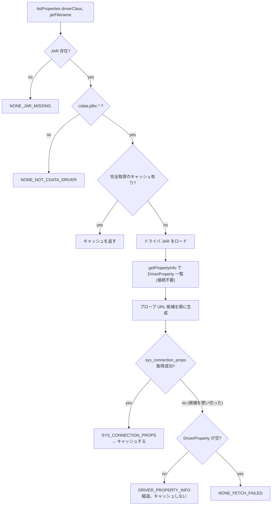

# 接続プロパティ取得のフォールバック — 設計

| 項目 | 内容 |
|---|---|
| 開発タイトル | connection-props-fetch-fallback |
| 対応 Issue | [#15](https://github.com/sugimomoto/KintoneExternalAppCDataSample/issues/15) |
| 作成日 | 2026-09-29 |
| 要求定義 | [requirements.md](requirements.md) |

---

## 1. 設計方針

### 1.1 主要な設計判断

| # | 判断 | 理由 | 却下した代替案 |
|---|---|---|---|
| D-1 | **段階的プローブ**方式を採る。候補となる接続文字列を順に試し、最初に成功したものの結果を使う | ドライバのバージョン・データソースごとの差を、ドライバ固有の分岐なしに吸収できる（C-3） | バージョン番号で分岐する案 → `Implementation-Version` の意味は CData 側の都合で変わり得るため不採用 |
| D-2 | ダミー値は**プロパティ名ベースのヒューリスティック**で決める | 書式情報を取得する手段がない（F-4）。`ConnectionStringMasker` が同じ方式で機能しているので踏襲する | 検証エラーメッセージから書式を読む案 → ロケール依存（F-11, C-1）で不採用 |
| D-3 | ダミー接続には `Offline=true` と `InitiateOAuth=OFF` を付与する。ただし**そのプロパティが存在する場合のみ** | AC-8（実通信・OAuth 認可を起こさない）を明示的に担保する。未知プロパティは接続を壊す（F-9, C-2） | 常に付与する案 → 持たないドライバで全滅するため不採用 |
| D-4 | URL 系ダミー値は `http://cdata-probe.invalid` を使う | `.invalid` は RFC 2606 の予約 TLD で**名前解決されないことが保証される**。書式 `^(http\|https):\/\/.*` も満たす（F-3） | `http://localhost` → 手元で動いているサービスに当たる可能性があるため不採用 |
| D-5 | 取得結果に**取得方法 (`PropertySource`)** を持たせる | UI がケースごとに出し分けるため（AC-6, AC-7）。縮退かどうかをキャッシュ判断にも使う（D-6） | 空リストで判断する現行方式 → 3 ケースを区別できない |
| D-6 | **完全取得の結果だけをキャッシュする** | 縮退・失敗をキャッシュすると、原因を解消しても画面が回復しない。縮退の再取得は `getPropertyInfo`（接続不要）のみで安く済む | 取得方法をキャッシュキーに含める案 → キーが増えるだけで、縮退を残す意味がない |
| D-7 | IO 境界を `DriverMetadataSource` インターフェースに切り出す | `DriverManager` 直呼びだとプローブ戦略の分岐をユニットテストできない。テスト規約 4.9 の「外部システムとの境界のみモック」に合致 | `DriverManager` をそのまま使い手動確認のみとする案 → TDD 規約（4.10）を満たせない |
| D-8 | 機密判定は `ConnectionStringMasker.isSensitive` を公開して再利用する | 縮退フォームでも認証情報を平文入力欄にしない（AC-10）。判定ルールの二重実装を避ける（#11 の教訓） | 縮退マッパー内に独自リストを持つ案 → ルールが分岐して漏れる |

### 1.2 取得フロー



### 1.3 プローブ URL 候補の生成規則

`jdbcPrefix` を `jdbc:sapgateway` として、以下の順に候補を作る。
**同一文字列は後続を捨てる**（`distinct`）ため、実際の試行回数は 1〜3 回になる。

| 順 | 候補 | 内容 |
|---|---|---|
| 1 | `<prefix>:Offline=true;InitiateOAuth=OFF;` | 安全プロパティのみ。25.x 系はここで成功する |
| 2 | `<prefix>:` | 安全プロパティを持たないドライバ向けの素の形 |
| 3 | `<prefix>:Offline=true;InitiateOAuth=OFF;URL=http://cdata-probe.invalid;Namespace=probe;...` | 安全プロパティ + 必須プロパティのダミー値。26.x 系はここで成功する |
| 4 | `<prefix>:URL=http://cdata-probe.invalid;Namespace=probe;...` | ダミー値のみ |

- 安全プロパティは `getPropertyInfo` の名前一覧に含まれるものだけを付ける（D-3）
- 必須プロパティが 0 件なら候補 3・4 は候補 1・2 と同一になり `distinct` で消える
- 候補 1 と 2 が同一（安全プロパティ無し）の場合も同様に 1 本に縮む

### 1.4 ダミー値のヒューリスティック

プロパティ名（小文字化）に対して上から順に判定する。

| 条件 | 値 | 根拠 |
|---|---|---|
| `url` / `uri` / `endpoint` を含む | `http://cdata-probe.invalid` | F-3 の書式制約。`.invalid` は解決されない（D-4） |
| `Use` / `Is` / `Enable` / `Allow` / `Ignore` / `Recurse` / `Include` / `Exclude` で始まる | `False` | 真偽値プロパティが必須に含まれる実例がある（Salesforce の `UseSandbox`、Google Sheets の `RecurseFolders` / `IgnoreErrorValues`）。文字列を入れると型検証で落ちる |
| `port` を含む | `443` | 数値プロパティの型検証対策 |
| それ以外 | `probe` | 汎用ダミー |

いずれも**書式検証を確実に通すことは保証しない**。通らなければ次の候補、最終的に縮退フォームへ落ちる。

---

## 2. 変更・追加するコンポーネント

| ファイル | 区分 | 内容 |
|---|---|---|
| `jdbc/DriverProperty.kt` | 新規 | `DriverPropertyInfo` の値オブジェクト。名前の末尾空白を除去（F-7） |
| `jdbc/ConnectionPropertyProbe.kt` | 新規 | プローブ URL 候補の生成・ダミー値のヒューリスティック（純粋関数） |
| `jdbc/DegradedPropertyMapper.kt` | 新規 | `DriverProperty` → `ConnectionProperty` の縮退マッピング（純粋関数） |
| `jdbc/DriverMetadataSource.kt` | 新規 | IO 境界のインターフェース + `DriverManager` 実装 |
| `jdbc/JdbcConnectionPropertyInspector.kt` | 変更 | 段階的プローブの統括。戻り値を `ConnectionPropertiesResult` に変更。完全取得のみキャッシュ |
| `jdbc/ConnectionStringMasker.kt` | 変更 | `isSensitive` を公開（D-8） |
| `web/views/ConnectionsView.kt` | 変更 | `ConnectionPropertiesResult` を受け取り、`PropertySource` で表示を出し分け。必須を含むカテゴリを展開 |
| `web/routes/ConnectionsRoutes.kt` | 変更 | `listProperties` の戻り値変更に追従 |

テスト:

| ファイル | 区分 | 内容 |
|---|---|---|
| `jdbc/ConnectionPropertyProbeTest.kt` | 新規 | ダミー値・候補生成・順序・重複排除 |
| `jdbc/DegradedPropertyMapperTest.kt` | 新規 | 名前の trim・機密判定・必須の引き継ぎ |
| `jdbc/JdbcConnectionPropertyInspectorTest.kt` | 新規 | プローブ戦略の分岐・キャッシュ方針（`DriverMetadataSource` の fake を注入） |
| `jdbc/ConnectionStringMaskerTest.kt` | 変更 | `isSensitive` の直接テストを追加 |

---

## 3. データ構造

### 3.1 `DriverProperty`

`java.sql.DriverPropertyInfo` を、そのままドメインに持ち込まずに包む。
理由は (a) `name` の末尾空白（F-7）をここで正規化したい、
(b) `DriverPropertyInfo` は可変クラスでテストの組み立てが読みにくい。

```kotlin
data class DriverProperty(
    val name: String,
    val description: String,
    val required: Boolean,
    val allowedValues: List<String>,
) {
    companion object {
        fun from(info: DriverPropertyInfo): DriverProperty = DriverProperty(
            name = info.name.trim(),
            description = info.description ?: "",
            required = info.required,
            allowedValues = info.choices?.toList() ?: emptyList(),
        )
    }
}
```

### 3.2 `ConnectionPropertiesResult` / `PropertySource`

```kotlin
/**
 * 接続プロパティ取得の結果。`source` で「どこまで取れたか」を表す。
 * UI はこれを見てフォーム・警告の出し分けを行う。
 */
data class ConnectionPropertiesResult(
    val properties: List<ConnectionProperty>,
    val source: PropertySource,
) {
    val isDegraded: Boolean get() = source == PropertySource.DRIVER_PROPERTY_INFO

    companion object {
        fun unavailable(source: PropertySource) = ConnectionPropertiesResult(emptyList(), source)
    }
}

enum class PropertySource {
    /** `sys_connection_props` から完全に取得できた（通常経路） */
    SYS_CONNECTION_PROPS,

    /** `Driver.getPropertyInfo` のみ取得できた。Category / Hierarchy / Sensitivity は欠落 */
    DRIVER_PROPERTY_INFO,

    /** ドライバクラスが `cdata.jdbc.*` 形式でない */
    NONE_NOT_CDATA_DRIVER,

    /** `lib/` 配下に JAR が無い */
    NONE_JAR_MISSING,

    /** CData ドライバだが、どの手段でもプロパティが取れなかった */
    NONE_FETCH_FAILED,
}
```

`properties` と `source` を 1 つの enum にまとめず sealed class にする案もあるが、
View 側が `when (result.source)` の 1 箇所で全ケースを網羅できる方が読みやすいためフラットな enum にする。

### 3.3 `DriverMetadataSource`

```kotlin
/**
 * ドライバメタデータ取得の IO 境界。
 * プローブ戦略（[ConnectionPropertyProbe]）をユニットテストするために切り出している。
 */
interface DriverMetadataSource {
    /** JAR を動的ロードして `DriverManager` に登録する。 */
    fun loadDriver(jarPath: Path, driverClass: String)

    /** `Driver.getPropertyInfo` の結果。接続は張らない。 */
    fun driverProperties(jdbcPrefix: String): List<DriverProperty>

    /** [url] で接続して `sys_connection_props` を読む。失敗時は例外を投げる。 */
    fun sysConnectionProps(url: String): List<ConnectionProperty>
}
```

---

## 4. プローブ戦略の実装

### 4.1 `ConnectionPropertyProbe`

```kotlin
object ConnectionPropertyProbe {

    /** 解決されないことが保証された URL（RFC 2606 の予約 TLD）。 */
    const val PROBE_URL = "http://cdata-probe.invalid"

    /** メタデータ取得中に実通信・OAuth 認可を起こさないためのプロパティ。 */
    private val SAFETY_PROPERTIES = listOf("Offline" to "true", "InitiateOAuth" to "OFF")

    /**
     * 試行順に並んだプローブ URL 候補を返す。重複は除去済み。
     * 呼び出し側は先頭から試し、最初に成功したものを使う。
     */
    fun candidateUrls(jdbcPrefix: String, driverProperties: List<DriverProperty>): List<String>

    /** プロパティ名から書式検証を通しやすいダミー値を決める（§1.4）。 */
    fun dummyValueFor(propertyName: String): String
}
```

### 4.2 `JdbcConnectionPropertyInspector.listProperties`

```
1. JAR 存在確認            → 無ければ NONE_JAR_MISSING
2. jdbcPrefixOf            → 例外なら NONE_NOT_CDATA_DRIVER
3. キャッシュ参照           → 完全取得の結果があれば返す
4. loadDriver
5. driverProperties        → 例外なら空リストとして続行（プローブは試す）
6. candidateUrls を順に sysConnectionProps
     成功 → SYS_CONNECTION_PROPS、キャッシュに格納して返す
7. 全滅 → driverProperties が空でなければ DegradedPropertyMapper で縮退
8. それも空 → NONE_FETCH_FAILED
```

ステップ 6 の失敗は `debug` ログに留め、全候補が失敗した時点で 1 回だけ `warn` を出す。
現行は候補ごとに `warn` が出る形になるため、ログが読みにくくなるのを避ける。

---

## 5. 縮退マッピング

```kotlin
object DegradedPropertyMapper {
    fun toConnectionProperties(driverProperties: List<DriverProperty>): List<ConnectionProperty>
}
```

| `ConnectionProperty` | 値 | 備考 |
|---|---|---|
| `propertyName` / `displayName` | `DriverProperty.name` | trim 済み（F-7） |
| `shortDescription` | `DriverProperty.description` | `getPropertyInfo` は `sys_connection_props` の `ShortDescription` と同じ文言を返す（実測で一致） |
| `type` | `STRING` 固定 | 型情報が無い。真偽値は `allowedValues` も空（F-8）なので判別できない |
| `defaultValue` | `null` | `DriverPropertyInfo.value` は**プローブで渡したダミー値が入る可能性**があるため使わない（AC-9） |
| `allowedValues` | `DriverProperty.allowedValues` | 実測では常に空（F-8）だが、将来ドライバが返す場合に備えて通す |
| `category` | `""` | `getPropertyInfo` は返さない。View 側で「その他」に寄る |
| `required` | `DriverProperty.required` | そのまま |
| `sensitivity` | `PASSWORD` / `NONE` | `ConnectionStringMasker.isSensitive` で判定（D-8, AC-10） |
| `visible` | `true` | 全件表示する。隠す判断材料が無い |
| `hierarchy` | `""` | 取得できない。#14 の動的制御は縮退時は効かない |
| `ordinal` | リスト内の index | 元の並び順を保つ |
| `categoryOrdinal` | `0` | 単一カテゴリなので固定 |

---

## 6. UI 設計

### 6.1 `PropertySource` ごとの表示

| `source` | 表示 |
|---|---|
| `SYS_CONNECTION_PROPS` | 現行どおり（件数表示 + カテゴリ別フォーム） |
| `DRIVER_PROPERTY_INFO` | 注意バナー「ドライバから完全なプロパティ定義を取得できませんでした。簡易フォームを表示しています（カテゴリ分類は利用できません）。」 + 縮退フォーム + URL 直接入力欄を併記 |
| `NONE_NOT_CDATA_DRIVER` | 「CData JDBC Driver ではないため、プロパティフォームを生成できません。」+ URL 直接入力 |
| `NONE_JAR_MISSING` | 「ドライバ JAR が見つかりません。`lib/` 配下を確認してください。」+ URL 直接入力 |
| `NONE_FETCH_FAILED` | 「プロパティの取得に失敗しました。詳細はログを確認してください。」+ URL 直接入力 |

現行の「CData ドライバではない可能性があります」は `NONE_NOT_CDATA_DRIVER` の文言に置き換える（AC-6）。

### 6.2 カテゴリ展開ルールの変更

現行は `category == "Authentication"` のみ展開し、他は `<details>` で折りたたむ。
縮退フォームは `category` が空（=「その他」）になるため、このままでは
**必須プロパティが折りたたみの中に隠れる**。

展開条件を「`Authentication` である、**または必須プロパティを含む**」に変更する。

- 縮退フォームで必須プロパティが最初から見える（AC-3, AC-4）
- 完全取得時も、必須プロパティが `Authentication` 以外にあるデータソース
  （BCart の `PersonalAccessToken` / `OAuthAccessToken` 等）で入力箇所が見つけやすくなる
- `#14` で必須判定が認証方式依存になると、この規則はそのまま
  「いま必須のカテゴリが開く」挙動になり相性が良い

---

## 7. 影響範囲の分析

| 対象 | 影響 | 対応 |
|---|---|---|
| `web/views/ConnectionsView.kt` | `propertiesFormContent` の第 1 引数の型が変わる | シグネチャ変更。呼び出しは 2 箇所（同ファイル内 + `ConnectionsRoutes`） |
| `web/routes/ConnectionsRoutes.kt` `get("/connections/properties")` | `listProperties` の戻り値変更 | そのまま `propertiesFormContent` に渡す |
| `web/routes/ConnectionsRoutes.kt` `post("/connections/preview-url")` | `jdbcPrefixOf` を直接使っており影響なし | 変更なし |
| `web/routes/DriversRoutes.kt` | `invalidateCache()` 呼び出し 2 箇所 | 変更なし |
| 接続の保存・実行経路 | プロパティ取得はフォーム生成専用で、保存済み接続文字列には触らない | 変更なし |
| `src/browserTest` の E2E | 接続作成画面のバナー文言に依存していないか確認が必要 | 文言アサーションがあれば更新 |

---

## 8. テスト設計

TDD で進める（規約 4.2）。純粋関数から着手する。

### 8.1 `ConnectionPropertyProbeTest`（最初に着手）

- `dummyValueFor` は URL を含む名前に解決されない URL を返す
- `dummyValueFor` は `Use` で始まる名前に `False` を返す
- `dummyValueFor` は `Port` を含む名前に数値を返す
- `dummyValueFor` はその他の名前に汎用ダミーを返す
- `candidateUrls` の先頭は安全プロパティのみの URL である
- `candidateUrls` は安全プロパティを持たないドライバでは付与しない
- `candidateUrls` は必須プロパティのダミー値を含む候補を後ろに置く
- `candidateUrls` は必須プロパティが無いとき重複候補を返さない
- `candidateUrls` はダミー値に `;` を含めない（接続文字列を壊さない）

### 8.2 `DegradedPropertyMapperTest`

- `name` の末尾空白が除去される
- `required` が引き継がれる
- 機密を示す名前は `Sensitivity.PASSWORD` になる（`Password` / `OAuthAccessToken` / `APIKey`）
- 非機密の名前は `Sensitivity.NONE` になる
- `defaultValue` に `DriverPropertyInfo.value` を持ち込まない
- `ordinal` が元の順序を保つ

### 8.3 `JdbcConnectionPropertyInspectorTest`（fake の `DriverMetadataSource` を注入）

- 1 番目の候補で成功したとき `SYS_CONNECTION_PROPS` を返す
- 1 番目が失敗し 3 番目で成功したとき `SYS_CONNECTION_PROPS` を返す（26.x 相当）
- 全候補が失敗し `getPropertyInfo` が取れたとき `DRIVER_PROPERTY_INFO` を返す
- 全候補が失敗し `getPropertyInfo` も空のとき `NONE_FETCH_FAILED` を返す
- JAR が無いとき `NONE_JAR_MISSING` を返し、ドライバをロードしない
- `cdata.jdbc.*` でないクラス名で `NONE_NOT_CDATA_DRIVER` を返す
- 完全取得はキャッシュされ、2 回目は `DriverMetadataSource` を呼ばない
- 縮退結果はキャッシュされず、2 回目も取得を試みる
- `invalidateCache` 後は再取得する

### 8.4 実ドライバでの確認（手動・CI 対象外）

`lib/` 配下の 4 ドライバに対して、取得件数と `source` を確認するスクリプトを
`scripts/` に置く。期待値:

| ドライバ | 期待 `source` | 期待件数 |
|---|---|---|
| salesforce (25.x) | `SYS_CONNECTION_PROPS` | 268 |
| googlesheets (25.x) | `SYS_CONNECTION_PROPS` | 238 |
| bcart (25.x) | `SYS_CONNECTION_PROPS` | 193 |
| sapgateway (26.x) | `SYS_CONNECTION_PROPS` | 207 |

### 8.5 手動確認（Web UI）

- SAP Gateway を選択して動的フォームが出る（AC-1）
- Salesforce を選択して従来と同じフォームが出る（AC-2）
- 必須プロパティを含むカテゴリが展開されている（§6.2）

---

## 9. 受け入れ条件との対応

| AC | 対応する設計 | 検証 |
|---|---|---|
| AC-1 | §1.3 候補 3（ダミー値付きプローブ） | §8.4, §8.5 |
| AC-2 | §1.3 候補 1。F-10 により結果は同一 | §8.4 |
| AC-3 | §5 縮退マッピング | §8.3 |
| AC-4 | §6.1 注意バナー | §8.5 |
| AC-5 | §4.2 ステップ 2 | §8.3 |
| AC-6 | §6.1 `NONE_NOT_CDATA_DRIVER` の文言 | §8.3 + 目視 |
| AC-7 | §6.1 の 5 ケース出し分け | §8.3 + 目視 |
| AC-8 | D-3 / D-4（`Offline=true`, `InitiateOAuth=OFF`, `.invalid`） | §8.1 |
| AC-9 | §5 `defaultValue = null`、`Value` 列を読まない | §8.2 |
| AC-10 | D-8 `ConnectionStringMasker.isSensitive` | §8.2 |
| AC-11 | §8.1〜8.3 | — |
| AC-12 | — | `./gradlew ktlintCheck detekt test` |
