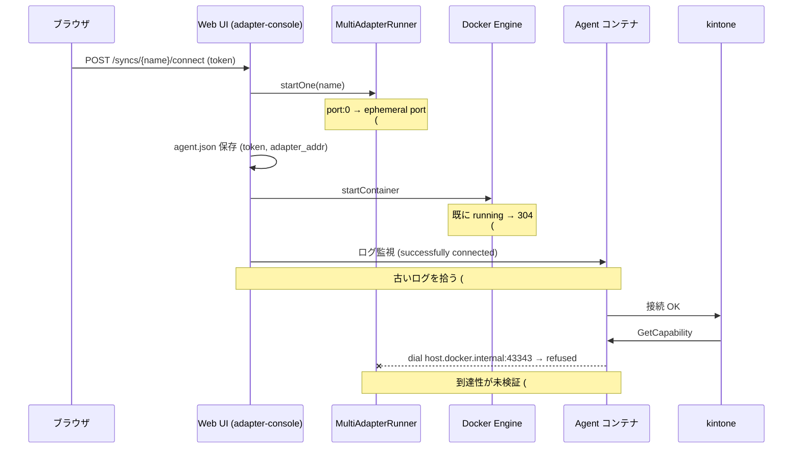
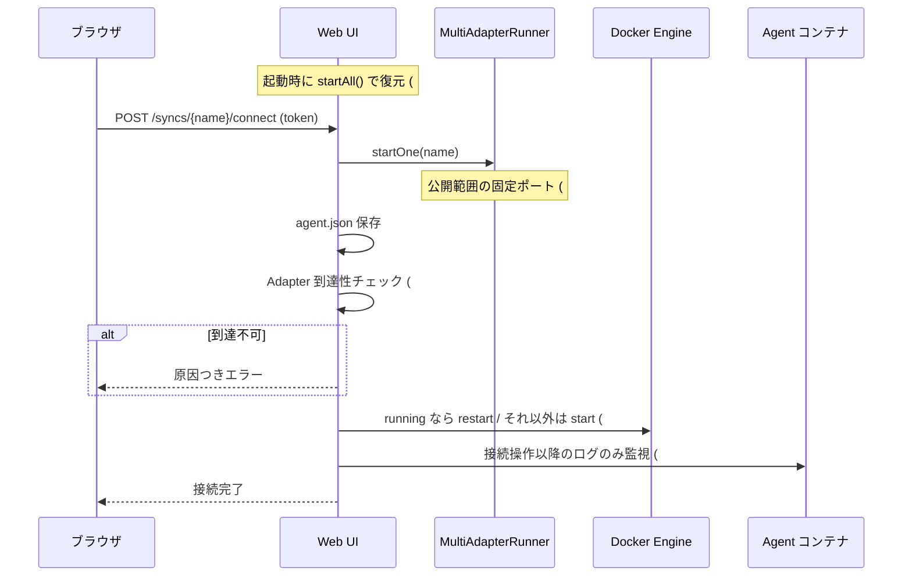

# 設計 — Agent 接続フローの不具合修正 (Issue #1-#4, #6, #7)

## 1. 全体像

現状の「接続して開始」フローと、問題が起きている箇所を示す。



修正後は以下になる。



## 2. 変更するコンポーネント

| # | ファイル | 変更内容 |
|---|---|---|
| #1 | `agent/AgentContainerManager.kt` | `start()` / `stop()` で `NotModifiedException` を型で捕捉 |
| #2 | `agent/AgentContainerManager.kt` | `restart()` を追加 |
| #2 | `agent/SyncConnectionService.kt` | running なら restart する `ensureRunningWithLatestConfig()` |
| #3 | `runtime/PortAllocator.kt` | 既定レンジを公開範囲 (18000-18099) に是正、`isPublished()` 追加 |
| #3 | `runtime/SyncPortAllocator.kt` (新規) | ConfigSource から使用中ポートを収集して採番 |
| #3 | `web/routes/TableWizardRoutes.kt` | `port=0` のとき採番結果を保存 |
| #3 | `web/views/TableWizardView.kt` | 入力欄の初期値を採番済みポートにする |
| #3 | `config/PortMigrator.kt` (新規) | 既存 `port: 0` Sync を公開範囲へ移行 |
| #4 | `agent/SyncConnectionService.kt` | `sinceSeconds` で接続操作以降のログのみ判定 + 失敗検知 |
| #6 | `web/AppContext.kt`, `cli/WebUiCommand.kt` | 起動時に移行 + `startAll()` |
| #7 | `agent/AdapterReachabilityChecker.kt` (新規) | `adapter_addr` への TCP 到達性チェック |
| #7 | `agent/SyncConnectionService.kt` | 到達性チェックを connect フローへ組み込み |

## 3. 個別設計

### 3.1 #1 — 304 ハンドリング

Docker Engine API は「既に起動済みの start」「既に停止済みの stop」に **304 Not Modified** を返す。
docker-java はこれを `NotModifiedException` にするが、メッセージは
`DockerException` が `String.format("Status %d: %s", 304, "")` で組み立てるため `"Status 304: "` となり、
既存の文字列マッチ (`"already started"` / `"not running"`) をすり抜ける。

```kotlin
// Before
} catch (e: Exception) {
    if (e.message?.contains("already started", ignoreCase = true) != true) throw e
}

// After
} catch (e: NotModifiedException) {
    log.debug { "Container already started: $containerName" }
}
```

`stop()` も同様。想定外の例外は従来どおり伝播させる（握りつぶし範囲を広げない）。

### 3.2 #2 — 設定変更を確実に反映する再起動

Agent は `agent.json` を**プロセス起動時にのみ**読む。`start()` は running に対して no-op なので、
新しい token / adapter_addr が反映されない。

`AgentContainerManager.restart()` を追加し、`SyncConnectionService` は状態に応じて分岐する。

| コンテナ状態 | 動作 |
|---|---|
| `NOT_FOUND` | `ensureCreated()` + `start()` |
| `STOPPED` | `start()` |
| `RUNNING` | `restart()` |

`restart()` は `dockerClient.restartContainerCmd(name).withTimeout(n)` を使う。
`NotFoundException` は `ensureCreated()` + `start()` にフォールバックする。

### 3.3 #3 — ポート採番

**公開範囲の単一定義**: `PortAllocator.DEFAULT_START = 18_000` / `DEFAULT_END = 18_099` に是正する
（現状の 19_000 は `docker-compose.yml` の publish 範囲とズレている）。
`docker-compose.yml` 側にはコメントで参照先を書き、乖離したときに気付けるようにする。

**採番ロジック** — `SyncPortAllocator`:

```
allocate(excludeSync: String?): Int
  1. configSource.listTables() の server.port を収集（0 は無視、excludeSync は除外）
  2. runner.listActive() の実ポートも収集（設定と実態のズレを吸収）
  3. PortAllocator(range) に reserve() して findAvailable() を呼ぶ
  4. 範囲を使い切ったら IllegalStateException（UI でメッセージ表示）
```

`findAvailable()` は実際に `ServerSocket` を bind して確認するため、
他プロセスが掴んでいるポートも避けられる。

**ウィザード**: 入力欄の初期値を `allocate()` の結果にする。`0` が送られてきた場合も
保存直前に `allocate()` して実ポートを書き込む（`port: 0` を新規に作らない）。
ラベルも「Server Port (空きポートを自動採番)」に変更する。

**既存 Sync の移行** — `PortMigrator`:

```
migrate(): List<Migration>
  for each table where server.port == 0:
      newPort = allocator.allocate(excludeSync = table)
      configSource.saveTableSet(table, set.copy(server = set.server.copy(port = newPort)))
      log.info { "port 0 → newPort に移行しました: table" }
```

- `jdbc-ref` で保存されている Sync は `saveTableSetWithRef` で保存し直し、参照形式を保つ
- `agent.json` が既にある Sync は `adapter_addr` も同時に更新する（次回起動時に整合する）
- 環境変数 `AUTO_MIGRATE_PORTS=false` で無効化できる

### 3.4 #4 — 接続判定

`fetchLogs(syncName, tail, sinceSeconds)` の `sinceSeconds` を使い、**接続操作の開始時刻以降**の
ログだけを判定対象にする。Docker の `since` は秒精度のため 2 秒のマージンを取る。

```kotlin
val startedAt = System.currentTimeMillis()
...
val elapsed = ((System.currentTimeMillis() - startedAt) / 1000).toInt() + SINCE_MARGIN_SEC
val logs = containerMgr.fetchLogs(syncName, tail = 200, sinceSeconds = elapsed)
when {
    logs.contains(MARKER_CONNECTED) -> Connected
    AUTH_FAILURE_MARKERS.any { logs.contains(it) } -> AuthFailed  // 即時失敗
    else -> 継続
}
```

`AUTH_FAILURE_MARKERS` = `token has been revoked`, `Unauthenticated`, `invalid token`。
認証失敗を検知したらタイムアウトを待たずに `Failure` を返す。

### 3.5 #6 — 起動時復元

`AppContext.create()` に `autoStart: Boolean` を追加し、以下の順で実行する。

```
1. PortMigrator.migrate()   ... port: 0 を公開範囲へ移行 (AUTO_MIGRATE_PORTS)
2. runner.startAll()        ... 設定済み Sync の Adapter を起動 (AUTO_START_ADAPTERS)
```

`startAll()` は個別失敗を catch + ログして継続する実装が既にあるため、
1 件の設定不備で Web UI 全体が起動できなくなることはない。

起動サマリを `WebUiCommand` の echo に追加し、何件起動したかが分かるようにする。

| 環境変数 | 既定 | 用途 |
|---|---|---|
| `AUTO_START_ADAPTERS` | `true` | 起動時に全 Adapter を起動する |
| `AUTO_MIGRATE_PORTS` | `true` | `port: 0` の Sync を公開範囲へ移行する |

### 3.6 #7 — 到達性チェック

`AdapterReachabilityChecker` は `agent.json` の `adapter_addr` に対して TCP 接続を試みる。
Web UI がコンテナ内で動く場合、`host.docker.internal:<port>` への到達経路は
Agent コンテナとまったく同じ（どちらも host-gateway 経由でホストの publish 済みポートに出る）ため、
これで Agent 視点の到達性を代理検証できる。

```
check(adapterAddr): Result
  1. host:port に connect (timeout 2s) → 成功なら Reachable
  2. 失敗 かつ host が host.docker.internal で名前解決できない
     （= Web UI が Docker 外で動いている）→ 127.0.0.1:port で再試行
  3. なお失敗 → Unreachable
       - port が公開範囲外 → 「ポート X は Docker で公開されていません。
         18000-18099 の範囲で設定し直してください」
       - 範囲内 → 「Adapter が起動していない可能性があります」
```

`SyncConnectionService.connect()` では **agent.json 保存直後・コンテナ起動前**に実行し、
到達不可なら Agent を再起動せずに `Failure` を返す（無駄な再接続を起こさない）。

### 4. 影響範囲

| 影響先 | 内容 |
|---|---|
| 既存の `config/tables/*/server.yaml` | `port: 0` の 8 件が公開範囲のポートへ書き換わる（初回起動時、ログ出力あり） |
| 既存の `agent/tables/*/agent.json` | 移行対象 Sync の `adapter_addr` が更新される |
| Web UI 起動時間 | `startAll()` の分だけ延びる（JDBC 接続は遅延初期化のため軽微） |
| Docker 非利用構成 | `AgentContainerManager == null` の経路は変更なし。到達性チェックは localhost で行う |
| `PortAllocator` の既定レンジ | 18000-19000 → 18000-18099。明示レンジを渡している既存テストには影響しない |

### 5. テスト方針

| 対象 | 方式 |
|---|---|
| #1 / #2 のコンテナ制御 | `mockk` で `DockerClient` をモックし、304 と状態分岐を検証（Docker 不要） |
| #3 の採番 | `SyncPortAllocator` に fake ConfigSource を渡し、衝突回避・範囲外を検証 |
| #3 の移行 | 一時ディレクトリの `YamlConfigSource` に `port: 0` を作って移行結果を検証 |
| #4 の判定 | ログ取得をラムダ差し替えにして、古いログ／認証失敗／成功の 3 ケースを検証 |
| #7 の到達性 | `ServerSocket` を立てて Reachable、閉じた状態で Unreachable を検証 |
| #6 の復元 | `MultiAdapterRunnerTest` の既存パターンを踏襲して `startAll()` を確認 |

手動確認は実環境（Categories / 稼働中の 7 コンテナ）で行う。
