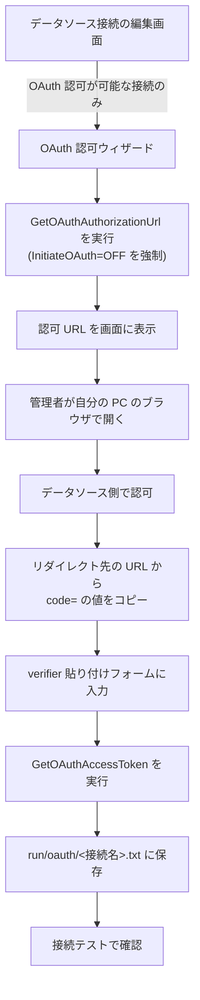

# OAuth 認可ウィザード — 設計

| 項目 | 内容 |
|---|---|
| 開発タイトル | oauth-authorization-wizard |
| 対応 Issue | [#12](https://github.com/sugimomoto/KintoneExternalAppCDataSample/issues/12) |
| 作成日 | 2026-09-29 |
| 要求定義 | [requirements.md](requirements.md) |

---

## 1. 設計方針

### 1.1 主要な設計判断

| # | 判断 | 理由 | 却下した代替案 |
|---|---|---|---|
| D-1 | **verifier 貼り付け方式**にする | Issue の方針（C-1）。コールバックを自前でホストすると、OAuth アプリ側にリダイレクト URI を登録し直す作業が増える | 自前コールバック方式 |
| D-2 | ウィザードの接続では **`InitiateOAuth=OFF` を強制**する | ユーザーの接続文字列が `GETANDREFRESH` のまま（実データの salesforce 接続がこれ）だと、接続を張った瞬間にドライバーがブラウザを開こうとして 60 秒タイムアウトする | ユーザーの値をそのまま使う案 → ウィザード自体が固まる |
| D-3 | 認可可否は **プロシージャの有無**で判定する | SAP Gateway には OAuth プロシージャが無い（F-7）。データソース名で分岐しない（C-4） | `AuthScheme` だけで判定する案 → 非対応ドライバーで使えないウィザードを見せる |
| D-4 | 認可 URL は**クエリを落として**ログに出す | URL にクライアント ID が含まれる（AC-11）。ホスト + パスだけならデバッグに足りる | URL 全体を出さない案 → 障害調査で手掛かりが無くなる |
| D-5 | verifier は**一切ログに出さない** | 認可コードそのもの（AC-12）。マスクして出す価値がない | マスクして出す案 |
| D-6 | トークン取得は **`OAuthSettingsLocation` 経由**でキャッシュに保存する | #11 で一本化したパスを使う（C-2）。接続文字列は書き換えない（C-5） | 取得したトークンを接続文字列に書き戻す案 |
| D-7 | ウィザードは**編集画面からの遷移**にする | 接続が保存済みであることが前提（クライアント ID / シークレットが必要） | 新規作成画面に置く案 |

### 1.2 フロー



### 1.3 CallbackUrl の扱い

| 状態 | 動作 |
|---|---|
| 接続文字列に `CallbackURL` がある | その値を使う |
| 無い | ドライバー既定（Salesforce なら `http://localhost:33333`）が使われる |

既定のまま認可すると、リダイレクト先でブラウザは接続エラーになる。
**それでも URL のクエリに `code=` が付くのでコピーできる**（CData のヘッドレス手順そのもの）。
ウィザードでこの点を明示する。

---

## 2. 変更・追加するコンポーネント

| ファイル | 区分 | 内容 |
|---|---|---|
| `jdbc/OAuthCapability.kt` | 新規 | 認可可否の判定（`AuthScheme` の判定 + プロシージャの有無） |
| `jdbc/OAuthAuthorizer.kt` | 新規 | `GetOAuthAuthorizationUrl` / `GetOAuthAccessToken` の実行 |
| `jdbc/OAuthUrlMasker.kt` | 新規 | 認可 URL のクエリを落とす |
| `jdbc/JdbcUrlEnhancer.kt` | 変更 | `withInitiateOAuthOff(url)` を追加 |
| `web/views/ConnectionOAuthView.kt` | 新規 | ウィザード画面 |
| `web/routes/ConnectionOAuthRoutes.kt` | 新規 | ウィザードの 2 エンドポイント |
| `web/views/ConnectionsView.kt` | 変更 | 編集画面に導線を追加（条件付き） |
| `web/WebUiServer.kt` | 変更 | ルート登録 |
| `error/ErrorMessageTranslator.kt` | 変更 | OAuth 系のルールを追加 |

テスト:

| ファイル | 区分 | 内容 |
|---|---|---|
| `jdbc/OAuthCapabilityTest.kt` | 新規 | `AuthScheme` 判定 |
| `jdbc/OAuthUrlMaskerTest.kt` | 新規 | クエリの除去 |
| `jdbc/JdbcUrlEnhancerTest.kt` | 変更 | `withInitiateOAuthOff` |
| `error/ErrorMessageTranslatorTest.kt` | 変更 | OAuth 系のルール |

---

## 3. データ構造・API

### 3.1 `OAuthCapability`

```kotlin
object OAuthCapability {
    /** OAuth 系の AuthScheme か。接続文字列から判定する（純粋関数）。 */
    fun isOAuthAuthScheme(jdbcUrl: String): Boolean

    /** ドライバーに認可プロシージャがあるか。sys_procedures を引く。 */
    fun hasAuthorizationProcedure(connection: Connection): Boolean
}
```

OAuth 系の `AuthScheme` は実測値から列挙する（`OAuth` / `OAuthClient` / `OAuthPassword` /
`OAuthJWT` / `OAuthPKCE` / `AzureAD` / `AzureServicePrincipal` 等）。
判定は前方一致 `oauth` + 既知の値の集合で行う。

### 3.2 `OAuthAuthorizer`

```kotlin
/**
 * ドライバーのヘッドレス向け OAuth プロシージャを実行する。
 *
 * 認可 URL の生成は外部通信なしでできるが、トークン取得は実際に
 * データソースへリクエストを飛ばす。
 */
class OAuthAuthorizer(private val connection: Connection) {

    /** 認可 URL を生成する。出力は ResultSet の `Url` 列。 */
    fun authorizationUrl(callbackUrl: String?): String

    /** verifier からトークンを取得し、OAuthSettingsLocation に保存させる。 */
    fun fetchAccessToken(verifier: String, callbackUrl: String?)
}
```

`Statement.execute()` を使う（F-3）。パラメータは SQL リテラルに埋めるため、
**シングルクォートのエスケープが必須**（verifier は外部由来の文字列）。

### 3.3 `OAuthUrlMasker`

```kotlin
/** 認可 URL のクエリ文字列を落とす。クライアント ID が含まれるため。 */
fun maskQuery(url: String): String   // https://host/path?... -> https://host/path?***
```

---

## 4. 画面

### 4.1 導線（編集画面）

`AuthScheme` が OAuth 系のときだけ表示する。プロシージャの有無はウィザード側で判定する
（編集画面で毎回接続を張るのを避ける）。

```
[OAuth 認可を行う →]
```

### 4.2 ウィザード `/connections/{name}/oauth`

```
Step 1: 認可 URL を開く
  [認可 URL を開く ↗]   (target=_blank)
  コピー用: <textarea readonly>https://login.salesforce.com/services/oauth2/authorize?...</textarea>

  ⓘ リダイレクト先 (http://localhost:33333) はブラウザでエラーになりますが、
    アドレスバーの URL に code= が付きます。その値をコピーしてください。

Step 2: verifier を貼り付ける
  [code= の値] [認可を完了する]
```

### 4.3 完了・失敗

- 完了: 「トークンを保存しました」+ 接続テストへの導線
- 失敗: `ErrorMessageTranslator` の変換結果を表示

---

## 5. 影響範囲の分析

| 対象 | 影響 | 対応 |
|---|---|---|
| 編集画面 | OAuth 系の接続に導線が 1 つ増える | `AuthScheme` 非 OAuth では出ない |
| ログ出力 | 認可 URL はクエリを落として出す。verifier は出さない | D-4 / D-5 |
| ライブログ (SSE) | Adapter / Agent のログを流すもので、ウィザードは通らない | 影響なし（AC-13 は構造的に満たす） |
| 接続文字列 | 書き換えない | C-5 |
| OAuth キャッシュ | #11 のパスに保存される | C-2 |
| `InitiateOAuth` | ウィザードの接続だけ OFF を強制。保存値は変えない | D-2 |

---

## 6. テスト設計

### 6.1 `OAuthCapabilityTest`

- `AuthScheme=OAuth` を OAuth 系と判定する
- `OAuthClient` / `OAuthPassword` / `OAuthJWT` / `OAuthPKCE` / `AzureAD` を判定する
- `Basic` / `PersonalAccessToken` / `Token` を OAuth 系と判定しない
- `AuthScheme` が無い接続文字列で false を返す
- 大文字小文字を無視する

### 6.2 `OAuthUrlMaskerTest`

- クエリを `***` に置き換える
- クエリが無い URL はそのまま返す
- クライアント ID が残らない

### 6.3 `JdbcUrlEnhancerTest`（追加）

- `InitiateOAuth=GETANDREFRESH` を `OFF` に置き換える
- `InitiateOAuth` が無ければ追加する
- 大文字小文字を無視する

### 6.4 `ErrorMessageTranslatorTest`（追加）

- `OAUTH [30004]` でクライアント ID / シークレットの確認を促す
- `is not a valid stored procedure` で非対応を伝える

### 6.5 実機確認（限界あり）

| 項目 | 可否 |
|---|---|
| Salesforce で認可 URL が生成される | ✅ |
| SAP Gateway で導線が出ない / 非対応メッセージ | ✅ |
| verifier からトークン取得 | ❌ 本物の OAuth アプリと認可操作が必要 |
| 取得後の接続テスト成功 | ❌ 同上 |

---

## 7. 受け入れ条件との対応

| AC | 対応する設計 | 検証 |
|---|---|---|
| AC-1 / AC-2 / AC-3 | §4.1 + D-3 | §6.1, §6.5 |
| AC-4 / AC-5 | §4.2 | §6.5 |
| AC-6 / AC-7 | §3.2 | ❌ §6.5 の限界 |
| AC-8 | ウィザード全体 | 部分的 |
| AC-9 | C-2（#11 のパス） | §6.5 |
| AC-10 | — | ❌ §6.5 の限界 |
| AC-11 / AC-12 / AC-13 | D-4 / D-5 / §5 | §6.2 |
| AC-14 / AC-15 / AC-16 | §6.4 | §6.4, §6.5 |
| AC-17 | §6.1〜6.4 | — |
| AC-18 | — | `./gradlew test` |
