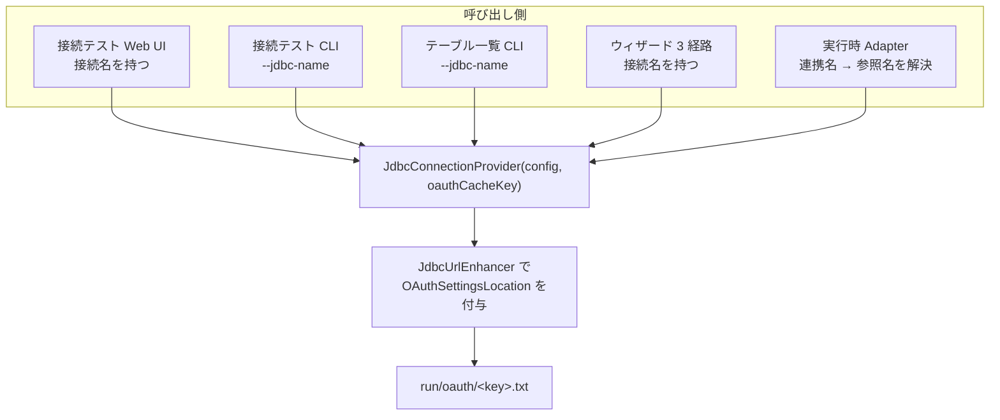

# OAuth キャッシュパスの一本化 — 設計

| 項目 | 内容 |
|---|---|
| 開発タイトル | oauth-cache-path |
| 対応 Issue | [#11](https://github.com/sugimomoto/KintoneExternalAppCDataSample/issues/11) |
| 作成日 | 2026-09-29 |
| 要求定義 | [requirements.md](requirements.md) |

---

## 1. 設計方針

### 1.1 主要な設計判断

| # | 判断 | 理由 | 却下した代替案 |
|---|---|---|---|
| D-1 | **`JdbcConnectionProvider` のコンストラクタでキャッシュキーを必須にする** | 接続を張る経路は必ずここを通る。引数が必須なら**新しい経路を追加したときにコンパイルエラーになる**（AC-3, C-2） | 呼び出し側で `JdbcUrlEnhancer` を通す規約にする案 → マスク処理がこの方式で 2 回漏れた（#10 → #16） |
| D-2 | キャッシュの単位を **データソース接続** にする | 3 つの理由。(a) 接続テストとウィザードは連携名を持たない（F-3）ので、全経路で共有できる唯一のキー。(b) OAuth トークンは資格情報に属するもので、連携に属さない。(c) 連携ごとに別キャッシュだと、リフレッシュトークンを更新する提供元で**互いのトークンを無効化し合う** | 連携名のまま揃える案 → F-3 により接続テスト・ウィザードで決められない |
| D-3 | 共有接続を参照しない連携は**連携名**をキーにする | インライン JDBC 設定には接続名が無い（F-4, AC-7） | インライン設定を禁止する案 |
| D-4 | 参照名の取得のため `ConfigSource` に問い合わせ口を足す | `loadTableSet` は `jdbc_ref` を捨てている（F-5）。実行時に接続単位のキーを決めるには参照名が必要 | 接続文字列のハッシュをキーにする案 → 人間が読めないパスになり、トークン値の変化でキーが変わる |
| D-5 | URL の付与は**接続を張るときだけ** | 保存済みの接続文字列を書き換えない（C-4）。`loadSharedJdbcConfig` で付与すると、編集画面に `OAuthSettingsLocation` が現れて保存で永続化されてしまう | 設定読み込み時に付与する案 |
| D-6 | 既存キャッシュは移行しない | 連携名 → 接続名は多対一で一意に決まらない。一度の再認可で解決する。README に明記する（AC-11） | 移行スクリプトを作る案 |

### 1.2 全体像



キャッシュキーは「共有接続名」。実行時は `jdbc_ref` を解決して同じ名前に到達する。

---

## 2. 変更・追加するコンポーネント

| ファイル | 区分 | 内容 |
|---|---|---|
| `jdbc/JdbcConnectionProvider.kt` | 変更 | コンストラクタに `oauthCacheKey` を必須追加。`init` で URL を付与 |
| `jdbc/JdbcUrlEnhancer.kt` | 変更 | `withOAuthCachePerTable` → `withOAuthCache` に改名（単位が連携でなくなる）。`cachePathFor` の引数名を `cacheKey` に |
| `config/ConfigSource.kt` | 変更 | `sharedJdbcRefOf(tableName): String?` を追加（既定 null） |
| `config/SqliteConfigSource.kt` | 変更 | `sharedJdbcRefOf` を実装 |
| `runtime/TableAdapterServer.kt` | 変更 | URL 付与をやめ、キャッシュキーを受け取ってプロバイダに渡す |
| `runtime/MultiAdapterRunner.kt` | 変更 | `sharedJdbcRefOf` でキーを解決して渡す。ファクトリの型を変更 |
| `web/routes/ConnectionsRoutes.kt` | 変更 | 接続テストで接続名をキーに渡す |
| `web/routes/TableWizardRoutes.kt` | 変更 | 3 経路で接続名をキーに渡す |
| `cli/TestConnectionCommand.kt` | 変更 | `--jdbc-name` をキーに渡す |
| `cli/ListTablesCommand.kt` | 変更 | 同上 |

テスト:

| ファイル | 区分 | 内容 |
|---|---|---|
| `jdbc/JdbcUrlEnhancerTest.kt` | 変更 | 改名に追従。キー生成の異常系を追加 |
| `config/SqliteConfigSourceTest.kt` | 変更 | `sharedJdbcRefOf` のテストを追加 |
| `runtime/TableAdapterServerTest.kt` | 変更 | ファクトリ型の変更に追従。キーがプロバイダへ渡ることを検証 |
| `runtime/MultiAdapterRunnerTest.kt` | 変更 | 同上 |
| `jdbc/JdbcConnectionProviderTest.kt` | 変更 | 引数追加に追従 |

---

## 3. 実装

### 3.1 `JdbcConnectionProvider`

```kotlin
/**
 * @param oauthCacheKey OAuth トークンキャッシュの識別子。**データソース接続名**を渡す。
 *   接続を張るすべての経路がここを通るため、必須引数にして付与忘れを防いでいる
 *   （接続文字列のマスク処理は規約で担保しようとして 2 回漏れた: #10 / #16）。
 */
class JdbcConnectionProvider(
    config: JdbcConfig,
    oauthCacheKey: String,
    oauthCacheBaseDir: String = DEFAULT_OAUTH_CACHE_DIR,
) : ConnectionProvider {

    private val config = config.copy(
        url = JdbcUrlEnhancer.withOAuthCache(
            config.url,
            JdbcUrlEnhancer.cachePathFor(oauthCacheBaseDir, oauthCacheKey),
        ),
    )
```

`DEFAULT_OAUTH_CACHE_DIR = "./run"`（現行の `TableAdapterServer` の既定値と同じ）。

### 3.2 `ConfigSource.sharedJdbcRefOf`

```kotlin
/**
 * 連携が参照している共通 JDBC 設定の名前。インライン設定の場合は null。
 *
 * OAuth キャッシュを接続単位で共有するために使う (Issue #11)。
 * `loadTableSet` は `JdbcConfig` に解決してしまい参照名が分からない。
 */
fun sharedJdbcRefOf(tableName: String): String? = null
```

既定実装を null にして、実装クラス以外を壊さない。

### 3.3 キャッシュキーの解決

```kotlin
// MultiAdapterRunner
val cacheKey = configSource.sharedJdbcRefOf(tableName) ?: tableName
```

共有接続を参照していればその名前、インライン設定なら連携名（D-3）。

### 3.4 `TableAdapterServer`

URL 付与の責務を手放し、キーを渡すだけにする。

```kotlin
class TableAdapterServer(
    val tableName: String,
    private val config: TableConfigSet,
    /** OAuth キャッシュの識別子。接続単位で共有するため、共通 JDBC 設定名が入る。 */
    private val oauthCacheKey: String = tableName,
    private val connectionProviderFactory: (JdbcConfig, String) -> ConnectionProvider = ::JdbcConnectionProvider,
)
```

`start()` からは `JdbcUrlEnhancer` の呼び出しを削除し、
`connectionProviderFactory(config.jdbc, oauthCacheKey)` にする。

---

## 4. 影響範囲の分析

| 対象 | 影響 | 対応 |
|---|---|---|
| 既存の OAuth キャッシュ | `run/oauth/<連携名>.txt` → `run/oauth/<接続名>.txt` に変わる。**一度だけ再認可が必要** | README に明記（D-6） |
| 同一接続を使う複数連携 | キャッシュを共有するようになる。リフレッシュトークンの取り合いが解消される | 意図した改善 |
| `connectionProviderFactory` の型 | `(JdbcConfig) -> ConnectionProvider` → 2 引数に変わる | テストの Fake 3 箇所を修正 |
| `JdbcConnectionProvider` の呼び出し 7 箇所 | すべてコンパイルエラーになる | キーを渡して修正。これが D-1 の狙い |
| 接続文字列のプレビュー・保存 | 付与は接続を張るときだけなので影響なし | 変更なし（C-4） |
| ログ出力 | プロバイダが出す接続文字列に `OAuthSettingsLocation` が含まれる | `ConnectionStringMasker` を通しており、パスは機密でないため問題なし |

---

## 5. テスト設計

### 5.1 `JdbcUrlEnhancerTest`（変更・追加）

- 改名 (`withOAuthCache`) に追従
- 既存: 付与 / 明示指定を尊重 / 末尾セミコロン / パス区切りの無害化
- 追加: キーが空文字のときの挙動
- 追加: `..` を含むキーでディレクトリを抜け出さない（AC-9、既存テストを拡張）

### 5.2 `SqliteConfigSourceTest`（追加）

- 共通 JDBC を参照する連携で参照名が返る
- インライン設定の連携で null が返る
- 存在しない連携で null が返る

### 5.3 `TableAdapterServerTest` / `MultiAdapterRunnerTest`（変更）

- ファクトリが 2 引数になったことに追従
- `TableAdapterServer` がファクトリに渡すキーが `oauthCacheKey` である
- `MultiAdapterRunner` が共有接続名をキーとして渡す

### 5.4 `JdbcConnectionProviderTest`（変更・追加）

- 引数追加に追従（H2 では OAuth プロパティは無害）
- 付与済みの URL がプールに渡ることを検証できるか確認する
  （`config` が private なため、検証は `JdbcUrlEnhancer` 側のテストで担保する）

### 5.5 手動確認

CData ドライバーでの実認可は本セッションでは行えない（OAuth のブラウザ認可が必要）。
代わりに以下を確認する。

- 接続テストのログに `OAuthSettingsLocation=./run/oauth/<接続名>.txt` が出る
- ウィザードのテーブル取得でも同じパスが出る
- 連携を開始したときのログでも同じパスが出る

---

## 6. 受け入れ条件との対応

| AC | 対応する設計 | 検証 |
|---|---|---|
| AC-1 | D-1（プロバイダで一律付与） | §5.5 |
| AC-2 | D-1 + `JdbcUrlEnhancer` | §5.1 |
| AC-3 | D-1（必須引数） | 7 箇所がコンパイルエラーになることを確認 |
| AC-4 | 既存の `withOAuthCache` の挙動 | §5.1 |
| AC-5 | D-2 | §5.3, §5.5 |
| AC-6 | D-2 | §5.5 |
| AC-7 | D-3 | §5.2, §5.3 |
| AC-8 | §5.1, §5.2 | — |
| AC-9 | C-5（既存のサニタイズ） | §5.1 |
| AC-10 | — | `./gradlew test` |
| AC-11 | D-6 | README |
