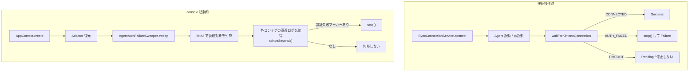

# 認証失敗した Agent コンテナの停止 — 設計

| 項目 | 内容 |
|---|---|
| 開発タイトル | stop-auth-failed-agents |
| 対応 Issue | [#19](https://github.com/sugimomoto/KintoneExternalAppCDataSample/issues/19) |
| 作成日 | 2026-09-29 |
| 要求定義 | [requirements.md](requirements.md) |

---

## 1. 設計方針

### 1.1 主要な設計判断

| # | 判断 | 理由 | 却下した代替案 |
|---|---|---|---|
| D-1 | 認証失敗を検知したら **console 側で `stop()` する** | 認証拒否は接続キーを入れ替えるまで直らない。`docker stop` された状態は `unless-stopped` でも復活しない（AC-2） | 再起動ポリシーを `on-failure` にする案 → Agent は認証失敗でも終了コード 0 なので**再起動されなくなる**だけで、一過性の失敗からも復帰しない（C-1） |
| D-2 | 起動時の棚卸しは **直近ログに認証失敗があるか**で判定する | ループ中のコンテナは 1 分おきに認証エラーを出し続けるので、短い時間窓に必ず現れる。正常稼働中のコンテナは直近ログが空（AC-6） | `State` に `RESTARTING` を足して Docker の状態で判定する案 → #20 のスコープで、本件が #20 をブロックしてしまう |
| D-3 | 判定マーカーを `AgentLogMarkers` に切り出す | 接続操作側と棚卸し側で文言がずれると片方だけ検知漏れする（C-4, AC-9） | 各所に定数を置く案 |
| D-4 | 棚卸しは専用クラス `AgentAuthFailureSweeper` に分ける | `AppContext` の起動処理に直接書くとテストできない。`AgentContainerManager` をモックして振る舞いを検証したい | `AppContext` の private 関数にする案 |
| D-5 | 棚卸しは**全例外を飲んで続行**する | Docker の状態に依存する処理で console の起動を落とさない（C-3） | 失敗を伝播させる案 |
| D-6 | 棚卸しは環境変数で切れるようにする | 既存の `AUTO_MIGRATE_PORTS` / `AUTO_START_ADAPTERS` と同じ流儀に合わせる | 常時有効にする案 |
| D-7 | 停止対象は **`listAll()` が返す管理対象コンテナ**のみ | ラベル `com.cdata.adapter.managed` が付いたものだけを扱う。手動で立てた無関係なコンテナを止めない | 名前の接頭辞だけで判定する案 |

### 1.2 2 つの経路



### 1.3 時間窓の決め方

Agent は失敗すると即終了し、Docker が約 1 分後に再起動する。
**ループ中なら 1 分の窓に必ず 1 回は認証エラーが現れる**。

取りこぼしを避けるため窓は 180 秒にする。正常稼働中のコンテナは
この窓に認証エラーを出さないので、誤検知しない。

---

## 2. 変更・追加するコンポーネント

| ファイル | 区分 | 内容 |
|---|---|---|
| `agent/AgentLogMarkers.kt` | 新規 | 認証失敗・接続成立の判定マーカーと判定関数 |
| `agent/AgentAuthFailureSweeper.kt` | 新規 | 管理対象コンテナの直近ログを見て、認証失敗しているものを停止 |
| `agent/SyncConnectionService.kt` | 変更 | `AUTH_FAILED` でコンテナを停止。マーカーを `AgentLogMarkers` に委譲 |
| `web/AppContext.kt` | 変更 | 起動時に `sweep` を呼ぶ（環境変数で切替可） |

テスト:

| ファイル | 区分 | 内容 |
|---|---|---|
| `agent/AgentLogMarkersTest.kt` | 新規 | マーカー判定（大文字小文字・部分一致） |
| `agent/AgentAuthFailureSweeperTest.kt` | 新規 | 停止対象の選別・例外時の継続・時間窓 |
| `agent/SyncConnectionServiceTest.kt` | 変更 | `AUTH_FAILED` で `stop` が呼ばれ、他の結果では呼ばれない |

---

## 3. データ構造

### 3.1 `AgentLogMarkers`

```kotlin
/**
 * Agent のログから接続状態を判定するマーカー。
 *
 * 接続操作時 ([SyncConnectionService]) と console 起動時の棚卸し
 * ([AgentAuthFailureSweeper]) の両方から使う。文言がずれると
 * 片方だけ検知漏れするため 1 箇所に集約している。
 */
object AgentLogMarkers {
    /** kintone 接続が成立したことを示す出力。 */
    const val CONNECTED = "successfully connected to kintone"

    /** 接続キーが拒否されたことを示す出力。再試行では直らない。 */
    private val AUTH_FAILURES = listOf("token has been revoked", "Unauthenticated", "invalid token")

    fun indicatesConnected(logs: String): Boolean
    fun indicatesAuthFailure(logs: String): Boolean
}
```

判定は大文字小文字を無視する（既存実装の `ignoreCase = true` を踏襲）。

### 3.2 `AgentAuthFailureSweeper`

```kotlin
/**
 * 認証失敗で再起動を繰り返している Agent コンテナを停止する。
 *
 * 接続操作の経路 ([SyncConnectionService]) だけでは、前のセッションから
 * 走り続けているコンテナに手が届かない。console 起動時に一度棚卸しする。
 */
class AgentAuthFailureSweeper(
    private val containerManager: AgentContainerManager,
    private val logWindowSeconds: Int = DEFAULT_LOG_WINDOW_SEC,
) {
    /** 停止した連携名を返す。 */
    fun sweep(): List<String>
}
```

---

## 4. 実装

### 4.1 `SyncConnectionService` の変更

```kotlin
ConnectionOutcome.AUTH_FAILED -> {
    // 接続キーが無効な状態では再試行しても直らない。
    // restart: unless-stopped のまま放置すると 1 分おきに永久に再試行する (Issue #19)。
    runCatching { containerMgr.stop(syncName) }
        .onFailure { log.warn(it) { "認証失敗後の Agent 停止に失敗: $syncName" } }
    Result.Failure(
        "接続キーが kintone に拒否されました。kintone 側で接続キーを再発行し、入力し直してください。" +
            "Agent コンテナは再試行を止めるため停止しました。",
    )
}
```

`TIMEOUT` は停止しない。Adapter の起動待ちなど一過性の要因があり、
Docker の再起動で復帰する余地を残す（AC-4）。

### 4.2 `AgentAuthFailureSweeper.sweep`

```
sweep():
  containers = containerManager.listAll()          # 管理対象ラベルで絞られている
  for c in containers:
     syncName = c.name.removePrefix(CONTAINER_PREFIX)
     logs = fetchLogs(syncName, sinceSeconds = logWindowSeconds)   # 失敗は空文字扱い
     if AgentLogMarkers.indicatesAuthFailure(logs):
        stop(syncName)
        stopped += syncName
  return stopped
```

- 各コンテナの処理を個別に `runCatching` で包み、1 つの失敗で棚卸し全体を止めない（D-5）
- 停止済みコンテナに当たっても `stop()` は 304 を正常系として扱うので害はない（F-6）
- `NOT_FOUND` のコンテナは `fetchLogs` が失敗して空文字になり、対象外になる

### 4.3 `AppContext` の変更

```kotlin
/** 起動時に、認証失敗で再起動を繰り返している Agent を停止する (Issue #19)。 */
autoStopAuthFailedAgents: Boolean = envFlag("AUTO_STOP_AUTH_FAILED_AGENTS", default = true),
```

`startAdapters` の後に呼ぶ。Adapter が先に立ち上がっていないと、
本来つながるはずの Agent を「到達できない」状態で評価してしまうため。

停止した連携名はログに出す（AC-8）。`AppContext` のフィールドとして画面に出すのは #20 の範囲。

---

## 5. 影響範囲の分析

| 対象 | 影響 | 対応 |
|---|---|---|
| `SyncConnectionService` の `AUTH_FAILED` の戻り値 | メッセージに「停止しました」を追記 | 既存テストが文言に依存していないか確認 |
| `SyncConnectionService` の他の分岐 | 変更なし | 回帰テストで担保 |
| Docker socket 不可の環境 | `containerMgr` が null。`sweep` を呼ばない | `AppContext` 側で null チェック（AC-7） |
| console の起動時間 | 管理対象コンテナ数 × ログ取得 1 回ぶん増える | 実環境は 11 件。`sinceSeconds` で絞るため転送量は小さい |
| 正常稼働中の Agent | 直近ログに認証エラーが無いので対象外 | テストで担保（AC-6） |

---

## 6. テスト設計

### 6.1 `AgentLogMarkersTest`

- `invalid token` を含むログを認証失敗と判定する
- `Unauthenticated` を含むログを認証失敗と判定する
- `token has been revoked` を含むログを認証失敗と判定する
- 大文字小文字が違っても判定する
- 正常な接続ログを認証失敗と判定しない
- 空文字を認証失敗と判定しない
- 接続成立マーカーを判定する

### 6.2 `AgentAuthFailureSweeperTest`

- 認証失敗しているコンテナを停止し、その連携名を返す
- 正常稼働中のコンテナは停止しない
- 直近ログが空のコンテナは停止しない
- 複数コンテナのうち失敗しているものだけを停止する
- ログ取得が例外を投げても、他のコンテナの処理を続ける
- 停止が例外を投げても、他のコンテナの処理を続ける
- `listAll` が空なら何もしない
- 指定した時間窓を `fetchLogs` に渡す

### 6.3 `SyncConnectionServiceTest`（追加）

- `AUTH_FAILED` のとき `stop` が呼ばれる
- `CONNECTED` のとき `stop` が呼ばれない
- `TIMEOUT` のとき `stop` が呼ばれない
- 停止が例外を投げても `Failure` を返す（例外を外に出さない）

### 6.4 実環境での確認

現在ループしている 4 つのコンテナに対して、console を再起動して停止されることを確認する。

| 連携 | 期待 |
|---|---|
| Product / ProductPlant / bcartorders / GoogleSheetOpportunitySample | 停止する |
| Categories / BCartCustomers / AccountHistory | 稼働のまま |

---

## 7. 受け入れ条件との対応

| AC | 対応する設計 | 検証 |
|---|---|---|
| AC-1 | §4.1 | §6.3 |
| AC-2 | D-1（`docker stop` は `unless-stopped` で復活しない） | §6.4 |
| AC-3 | §4.2, §4.3 | §6.2, §6.4 |
| AC-4 | §4.1（`TIMEOUT` は停止しない） | §6.3 |
| AC-5 | §4.1 | §6.3 |
| AC-6 | D-2 + §1.3 の時間窓 | §6.2, §6.4 |
| AC-7 | §5（null チェック） | 目視 |
| AC-8 | §4.3 | §6.4 |
| AC-9 | D-3 `AgentLogMarkers` | §6.1 |
| AC-10 | — | `./gradlew test` |
