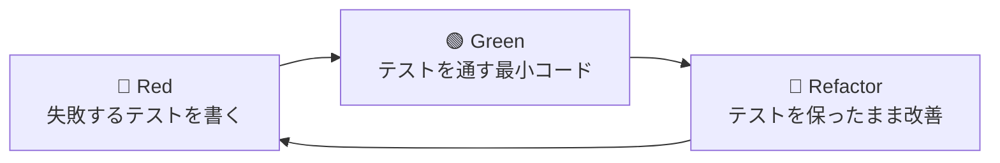

# 開発ガイドライン（Development Guidelines）

| 項目 | 内容 |
|---|---|
| プロダクト名 | kintone External App CData Adapter Sample |
| バージョン | 1.0（フェーズ1） |
| 作成日 | 2026-05-15 |
| ステータス | ドラフト |

---

## 1. コーディング規約

### 1.1 ベース規約

- **公式 Kotlin Coding Conventions** に従う：https://kotlinlang.org/docs/coding-conventions.html
- ktlint で自動チェック・自動整形
- detekt で静的解析

### 1.2 基本ポリシー

| 項目 | 方針 |
|---|---|
| 言語機能 | Kotlin らしい書き方を優先（拡張関数、スコープ関数、`when`、`data class`、`sealed class` を活用） |
| 不変性 | `val` を基本、`var` は明確な理由がある場合のみ |
| Null 安全 | `!!` は禁止。`?.` / `?:` / `requireNotNull()` / `checkNotNull()` で意図を明示 |
| 例外処理 | チェック例外なし（Kotlin 仕様）。境界では `ConnectException` で包む |
| 並行処理 | Coroutines を基本。`Thread.sleep`・`Future` 等は使わない |
| Immutability | コレクションは `List` / `Map` を優先、`MutableList` / `MutableMap` はローカルスコープのみ |

### 1.3 関数の長さ・複雑度

- 1関数 30行以内が目安（超過時は分割を検討）
- 循環的複雑度（Cyclomatic Complexity）: detekt のデフォルト閾値（10）以下
- 引数は5個以下が目安（超過時は `data class` で集約）

### 1.4 コメント方針

- **コメントは原則書かない**：命名で意図を表現する
- 書くべき場合：
  - 非自明な制約・仕様への対応（Why を書く）
  - 外部ドキュメント・Issue へのリンク
  - 既知のバグへのワークアラウンド理由
- 書くべきでない場合：
  - コードを読めば分かる内容（What の重複）
  - TODOコメント（GitHub Issue で管理）

### 1.5 例

```kotlin
// 悪い例
// id を取得する
val id = record.fields["id"]?.recordIdField?.value

// 良い例（命名で十分）
val recordId = record.recordIdValue()

// 書くべきコメント例
// CData JDBC は autoCommit=false がデータソース未対応の場合に
// SQLException(state=HYC00) を投げるため、その分岐を許容する
// https://www.cdata.com/kb/tech/jdbc-tx.rst
return try {
    conn.autoCommit = false
    // ...
} catch (e: SQLException) {
    if (e.sqlState == "HYC00") fallbackPath() else throw e
}
```

---

## 2. 命名規則

### 2.1 Kotlin 識別子

| 種別 | 規則 | 例 |
|---|---|---|
| クラス / インターフェース | UpperCamelCase | `FilterTranslator`, `AdapterServiceImpl` |
| 関数 / プロパティ | lowerCamelCase | `translateFilter()`, `pageSize` |
| 定数 | UPPER_SNAKE_CASE | `DEFAULT_POOL_SIZE`, `MAX_SELECT_LIMIT` |
| パッケージ | lowercase ドット区切り | `com.cdata.kintone.adapter.filter` |
| ファイル名 | クラス名と同じ | `FilterTranslator.kt` |
| ジェネリック型変数 | 1〜2文字 | `T`, `R`, `K`, `V` |
| ブール変数 | `is`/`has`/`should` プレフィックス | `isPlaintext`, `hasOptions` |

### 2.2 ドメイン命名

| 概念 | コード上の名前 | 由来 |
|---|---|---|
| kintone 側のフィールド識別子 | `kintoneFieldId` | protobuf `field_id` |
| JDBC のカラム名 | `jdbcColumn` | DB レベル |
| カラム種別（4種） | `ColumnType` enum: `TEXT`, `NUMBER`, `DATETIME`, `SELECTION` | 設定上の type 値 |
| protobuf の Field oneof | `Field.recordIdField` 等 | protobuf 生成コード |
| プロトコル種別 | `Connect`, `gRPC` | RPC プロトコル |

詳細は [glossary.md](glossary.md) 参照。

### 2.3 設定のキー名

設定は SQLite の JSON カラムに格納されるが、キー名は `@SerialName` で明示する。

- **kebab-case** に統一（`kintone-field-id`, `count-strategy`）
- Kotlin の `@SerialName` で対応：
  ```kotlin
  @Serializable
  data class ColumnConfig(
      @SerialName("kintone-field-id") val kintoneFieldId: String,
      @SerialName("jdbc-column") val jdbcColumn: String,
      val type: ColumnType,
  )
  ```

### 2.4 サブコマンド名

- **kebab-case**（`serve-all`, `test-connection`, `list-tables`）
- 動詞-名詞 形式

### 2.5 環境変数

- **UPPER_SNAKE_CASE**
- プレフィックス：
  - Adapter 全般：`ADAPTER_*`（`ADAPTER_CONFIG_DIR`）
  - データソース固有：データソース略号_*（`SF_USER`, `SF_PASSWORD`）

---

## 3. スタイリング規約

### 3.1 ktlint

`.editorconfig`：

```ini
root = true

[*.{kt,kts}]
indent_size = 4
indent_style = space
end_of_line = lf
insert_final_newline = true
trim_trailing_whitespace = true
max_line_length = 140

ktlint_standard_no-wildcard-imports = enabled
ktlint_standard_max-line-length = enabled
```

### 3.2 detekt

`detekt.yml`：

```yaml
complexity:
  LongMethod:
    threshold: 60
  CyclomaticComplexMethod:
    threshold: 15
naming:
  FunctionNaming:
    active: true
style:
  MagicNumber:
    ignoreNumbers: [-1, 0, 1, 2, 100, 1000]
  ReturnCount:
    max: 3
```

### 3.3 import 整理

- ワイルドカードインポート禁止
- import 順序：JVM 標準 → サードパーティ → プロジェクト内
- IntelliJ の "Optimize Imports" を使用

---

## 4. テスト規約と TDD（Test-Driven Development）

**本プロジェクトは TDD（テスト駆動開発）で進める。** プロダクションコードを書く前にテストを書くことを徹底する。

### 4.1 TDD の基本サイクル（Red → Green → Refactor）



| フェーズ | やること | やってはいけないこと |
|---|---|---|
| 🔴 Red | 仕様を表すテストを1つ書き、実行して失敗を確認 | 複数のテストを一気に書く / 通るテストを書く |
| 🟢 Green | テストを通す最小限のコードを書く | テストにない機能を実装する / 一般化する |
| 🔵 Refactor | 重複排除・命名改善・抽象化。テストは緑のまま | テストを変更する / 振る舞いを変える |

### 4.2 TDD の進め方（実装手順の原則）

1. **次の小さな振る舞いを決める**（例: 「`textEqual` を `field = ?` に変換できる」）
2. **失敗するテストを書く**（型・期待値・呼び出し方を表現）
3. **コンパイルだけ通す最小スタブを書く**（`throw NotImplementedError()` でも可）
4. **テストを実行し、想定通り Red を確認**
5. **最小限の実装で Green に**（ハードコード OK）
6. **同じ振る舞いの別パターンでテストを追加** → Red → Green を繰り返し、一般化を促す
7. **構造が悪ければ Refactor**（テストは緑のまま、コミット境界を意識）

### 4.3 テストの分類

| 種別 | 場所 | 用途 | TDD での扱い |
|---|---|---|---|
| ユニットテスト | `src/test/kotlin/.../<層名>/` | 単一クラスの動作検証 | **TDD の主戦場**。Red→Green→Refactor で書く |
| 統合テスト | `src/test/kotlin/.../integration/` | DB 含めた End-to-End。Testcontainers 使用 | 機能完成後の検証として追加 |
| プロトコルテスト | `scripts/test-adapter.sh` | curl による外部からの動作確認 | 手動・スモークテスト |

### 4.4 テスト命名規約

- バッククォート + 日本語可（推奨）：
  ```kotlin
  @Test
  fun \`textContains は field LIKE '%value%' に変換される\`() { ... }
  ```
- またはキャメルケース：
  ```kotlin
  @Test
  fun textContains_converts_to_LIKE_clause() { ... }
  ```
- 命名は **Given-When-Then の Then を述語的に書く**（テスト名で仕様が読める）

### 4.5 テストファイル命名

- `<対象クラス名>Test.kt` 形式
- 統合テストは `<シナリオ名>IntegrationTest.kt`

### 4.6 必須カバレッジ

TDD で進めるため、以下は **テスト先行で網羅** する：

| 対象 | カバレッジ目標 | TDD 推奨順 |
|---|---|---|
| `FieldTypeSuggester` | JDBC 型全種の推奨ロジック 100% | **最初に着手**（純粋関数で TDD 入門に最適） |
| `FilterTranslator` | **37/39 ケース 100%**（`multiple_selection_*` 除く） | 2番目（37個のテストケースを順に追加） |
| `QueryBuilder` | SELECT / INSERT / UPDATE / DELETE / COUNT 各パターン網羅 | 3番目 |
| `RowMapper` | 6つの Field 型 × NULL/非NULL のマトリクス | 4番目 |
| `JdbcMetadataInspector` | モックベースで `DatabaseMetaData` 主要API動作確認 | 5番目 |
| `AdapterServiceImpl` | 各 RPC の正常系・異常系（モック使用） | 6番目（統合テストも併用） |

新規クラスは **テストカバレッジ80%以上** を最低ラインとする。

### 4.7 テストデータ

- ユニットテスト：固定値・モック（MockK）を使用、外部依存を排除
- 統合テスト：インメモリ DB（H2）または Testcontainers の PostgreSQL を使用
- CData JDBC を介した実テストは別途検証スクリプト（CI 自動化対象外）

### 4.8 アサーションスタイル

- **JUnit 5 標準を採用**：`assertEquals`, `assertThrows`, `assertAll`
- 複数の assertion をひとつのテストで使う場合は `assertAll {}` で一括検証
- カスタムマッチャは原則使わない

### 4.9 モックの方針

- **MockK** を使用（`mockk()` / `every {}` / `verify {}`）
- モックは「外部システムとの境界」のみに使う：
  - JDBC `Connection` / `ResultSet` / `DatabaseMetaData` → モック OK
  - 内部ロジック（`FilterTranslator` 内部）→ モックせず実物を使う
- スタブ過剰（Over-mocking）を避ける：ロジックそのものをテストする

### 4.10 Test First を守るための実践ルール

| ルール | 内容 |
|---|---|
| プロダクションコード変更時 | **対応するテストが先にコミット**されていることを確認 |
| バグ修正時 | バグを再現する **失敗するテスト** を先に書き、それを通すように修正 |
| リファクタリング時 | テストは変更せず、緑のまま行う |
| カバレッジ計測 | `./gradlew test jacocoTestReport` で確認、低い箇所を明示的に追加 |
| TDD 違反コミット | レビューで指摘 → テストコミットを差し戻し |

### 4.11 TDD と PR レビュー

PR に以下が含まれることを確認：
- [ ] テストファイル（プロダクションコードと同じ PR 内、または前段の PR）
- [ ] テストが Red → Green になった証跡（コミット履歴で確認できる）
- [ ] テスト命名から仕様が読み取れる
- [ ] 内部実装の詳細をテストしていない（振る舞いをテスト）

---

## 5. Git 規約

### 5.1 ブランチ戦略

- メインブランチ：`main`
- 機能開発：`feature/<タスク短縮名>`（例：`feature/filter-translator`）
- バグ修正：`fix/<タスク短縮名>`
- ドキュメント：`docs/<タスク短縮名>`
- リファクタ：`refactor/<タスク短縮名>`

### 5.2 コミットメッセージ

Conventional Commits 風：

```
<type>(<scope>): <subject>

<body>
```

| type | 用途 |
|---|---|
| `feat` | 新機能追加 |
| `fix` | バグ修正 |
| `docs` | ドキュメント変更 |
| `refactor` | リファクタリング |
| `test` | テスト追加・修正 |
| `chore` | ビルド・補助ツール変更 |
| `perf` | パフォーマンス改善 |

例：
```
feat(filter): selection_in に NULL 値の OR 分岐を追加

NullableOption.option が null の場合、SQL の IN 句に NULL を
そのまま入れると無効化されるため、(field IN (...) OR field IS NULL) 形式に
分割する処理を追加。

Refs: #42
```

### 5.3 プルリクエスト

- タイトル：コミットメッセージの subject 行
- 本文テンプレート：
  ```markdown
  ## 概要
  <変更の目的>
  
  ## 変更内容
  - 〇〇を変更
  - △△を追加
  
  ## テスト方法
  - [ ] ユニットテスト
  - [ ] curl で GetCapability を確認
  
  ## 関連
  Refs: #issue番号
  ```

### 5.4 コミット粒度（TDD コミットパターン）

- 1コミット = 1論理的変更
- ビルドが通る状態を維持
- フォーマット変更とロジック変更は分ける

**TDD では Red → Green → Refactor の境界を意識してコミットする**：

| 区切り | コミットメッセージ例 |
|---|---|
| Red: 失敗するテスト追加 | `test(filter): add failing test for textContains case` |
| Green: 最小実装 | `feat(filter): support textContains in FilterTranslator` |
| Refactor: 構造改善 | `refactor(filter): extract WhereClause builder` |

すべての Red/Green/Refactor を細かく分けるかは状況次第（小さな変更なら test + feat をまとめても可）。ただし、レビューでは「テストが先に書かれた」ことが確認できる必要がある。

### 5.5 マージ戦略

- フェーズ1 では Squash Merge を基本
- PR 作成前にブランチを `main` に rebase

---

## 6. レビュー方針

### 6.1 セルフチェック（PR 作成前）

- [ ] `./gradlew test ktlintCheck detekt` がパス
- [ ] **テストが先にコミットされている（TDD）**
- [ ] **追加・変更されたプロダクションコードに対応するテストがある**
- [ ] **テスト名から仕様が読み取れる**
- [ ] curl で関連 RPC の動作確認（RPC 実装変更時）
- [ ] ドキュメント更新（該当箇所）
- [ ] CLAUDE.md の指示に逸脱がないか確認

### 6.2 レビュー観点

| 観点 | 確認事項 |
|---|---|
| **TDD 遵守** | **テストが先に書かれているか、テストカバレッジが十分か** |
| 機能 | 要件を満たしているか、エッジケース対応 |
| テスト | カバレッジ・アサーションの妥当性、振る舞いベース vs 実装詳細 |
| 性能 | N+1 クエリ・無駄なメモリ確保なし |
| セキュリティ | SQL インジェクション対策・機密情報マスキング |
| 保守性 | 命名・モジュール境界・コメント |
| 一貫性 | 既存パターンに沿っているか |

---

## 7. ドキュメンテーション規約

### 7.1 ドキュメント更新タイミング

| 変更内容 | 更新すべきドキュメント |
|---|---|
| 機能追加・変更 | `docs/product-requirements.md`, `docs/functional-design.md` |
| 設定ファイル変更 | `docs/functional-design.md`, README |
| API 仕様の解釈変更 | `.claude/skills/kintone-external-app-spec/reference/` |
| 開発手順変更 | `docs/development-guidelines.md`, README |
| 用語追加・変更 | `docs/glossary.md` |

### 7.2 永続的ドキュメント vs 作業単位ドキュメント

- **永続的**（`docs/`）：アプリの基本設計を表すもの
- **作業単位**（`.steering/`）：特定の改修タイミングの記録

CLAUDE.md のルールに従う。

### 7.3 README

ユーザー（パートナーSI）向けの最重要ドキュメント。以下を含めること：

- プロダクト概要
- クイックスタート（30分以内に Salesforce 接続）
- 設定ファイル全プロパティの説明
- CLI サブコマンド一覧
- トラブルシューティング
- ライセンス・著作権

### 7.4 図表

- Mermaid 記法を優先（GitHub で自動レンダリング）
- ASCII アートは補助的に
- 画像ファイルは `docs/images/` 配下（必要最小限）

---

## 8. セキュリティガイドライン

### 8.1 機密情報の取扱

| 機密度 | 例 | 取扱 |
|---|---|---|
| 高 | API トークン、パスワード、秘密鍵 | 接続文字列に直書きせず `${VAR}` で環境変数から渡す。`config.db` は `.gitignore` 必須 |
| 中 | 接続 URL（ユーザー名含む） | `config.db` に保存。リポジトリにはコミットしない |
| 低 | テーブル名、カラム名 | `config.db` に保存。機密ではない |

### 8.2 SQL インジェクション対策

- **必ず PreparedStatement のパラメータバインド使用**
- 動的な IN 句展開時は値の個数だけ `?` を生成
- ユーザー入力を文字列連結に使うコードは禁止（lint で検出）

### 8.3 ログ出力

- ERROR/WARN/INFO レベル：機密情報を出さない
- DEBUG レベル：SQL 文・パラメータを出してよいが、本番では DEBUG OFF
- 接続文字列の `Password=xxx` 部分は常にマスキング

---

## 9. 依存ライブラリの追加方針

新しい依存を追加する際の判断基準：

| 観点 | 質問 |
|---|---|
| 必要性 | 既存ライブラリで実現可能か？ |
| メンテナンス | 直近1年以内にコミットがあるか？ |
| ライセンス | Apache 2.0 と互換性があるか？（GPL系は注意） |
| サイズ | 配布物サイズを大きくしないか？ |
| 学習コスト | チームメンバーが理解できるか？ |

依存追加時は PR 説明に上記の検討結果を記載する。

---

## 10. パフォーマンス考慮事項

### 10.1 SQL の効率

- `SELECT *` を避け、必要なカラムのみ取得（`SelectRequest.fields` を尊重）
- `LIMIT` を必ず付与（無制限取得は禁止）
- `OFFSET` が大きい場合は警告ログ（性能劣化の警告）

### 10.2 メモリ管理

- ResultSet は `use {}` で必ずクローズ
- 大量レコードは ResultSet を一気に List 化しない（ストリーム処理を検討）
- バイナリ大量データは扱わない（kintone 側未対応のため不要）

### 10.3 接続プール

- HikariCP のデフォルトサイズを使用
- 1リクエスト 1接続のスコープ（try-with-resources）

---

## 10.5 開発運用上の落とし穴

### 10.5.1 shadowJar 再ビルドは Adapter 停止後に行う

- `./gradlew shadowJar` を実行する前に、稼働中の Adapter プロセス (`java -jar build/libs/adapter-*-all.jar serve`) を必ず停止すること
- 理由: shadowJar はビルド成果物を `build/libs/adapter-*.jar` に**上書き**する。Adapter JVM は遅延クラスロード方式なので、JAR が書き換わると未ロードのクラスを読み込めず `NoClassDefFoundError` を吐く
- 症状: Adapter ヘルスチェック (`grpc.health.v1.Health/Check`) は SERVING を返すが、実際の RPC（GetCapability 等）に応答できず Agent 側で「タイムアウト」「keepalive ping failed」エラーが連発する
- 対策: 開発時は [scripts/restart-stack.sh](../scripts/restart-stack.sh) の `--build` モードを使うか、手動で `lsof -ti:8083 | xargs kill` してから `./gradlew shadowJar`
- 発見契機: 2026-05-22 フェーズ2-A 実装中、28h 稼働していた Salesforce Adapter が「動いてるように見えてリクエストに応答しない」状態に陥った

---

## 11. 関連ドキュメント

- プロダクト要求：[product-requirements.md](product-requirements.md)
- 機能設計：[functional-design.md](functional-design.md)
- 技術仕様：[architecture.md](architecture.md)
- リポジトリ構造：[repository-structure.md](repository-structure.md)
- ユビキタス言語：[glossary.md](glossary.md)
- プロジェクト全体ルール：[../CLAUDE.md](../CLAUDE.md)
