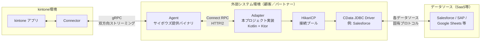
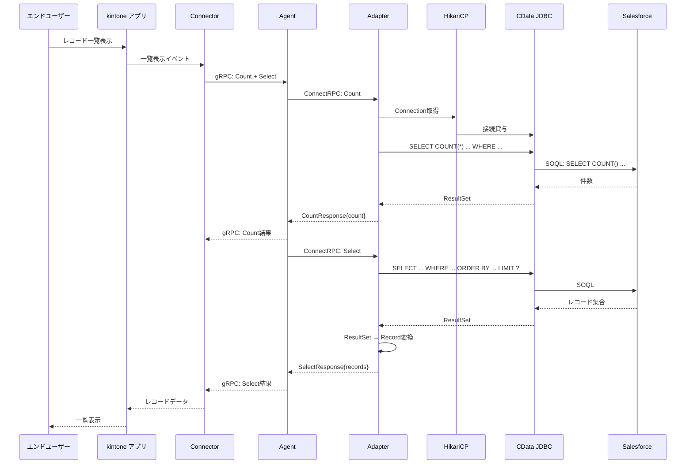
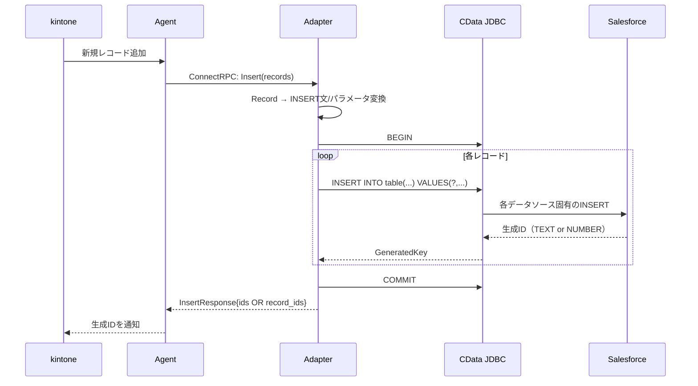
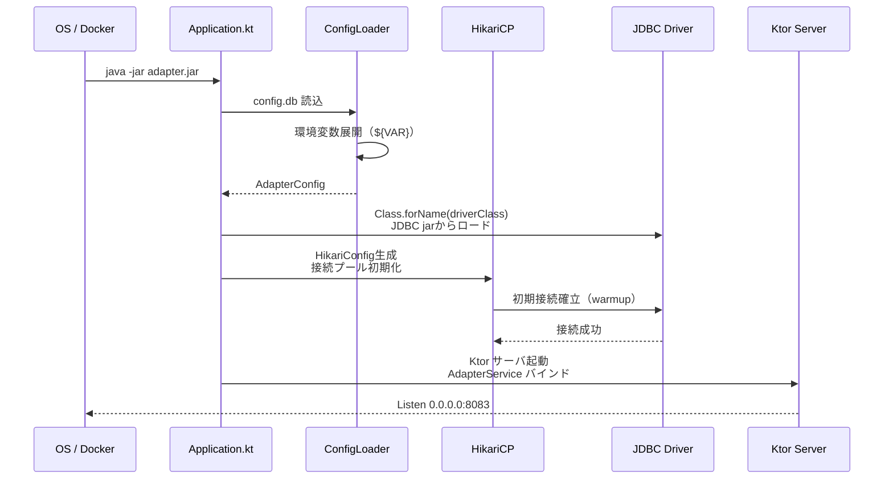
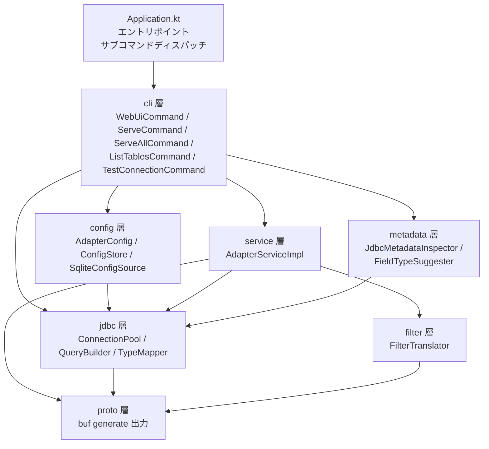
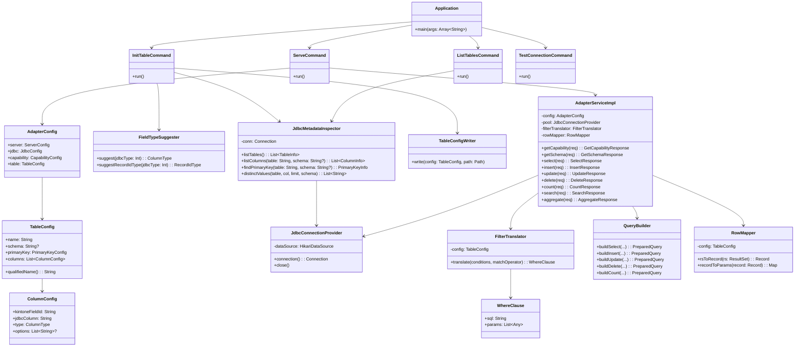
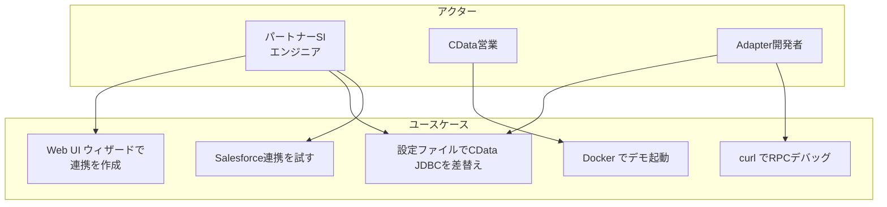
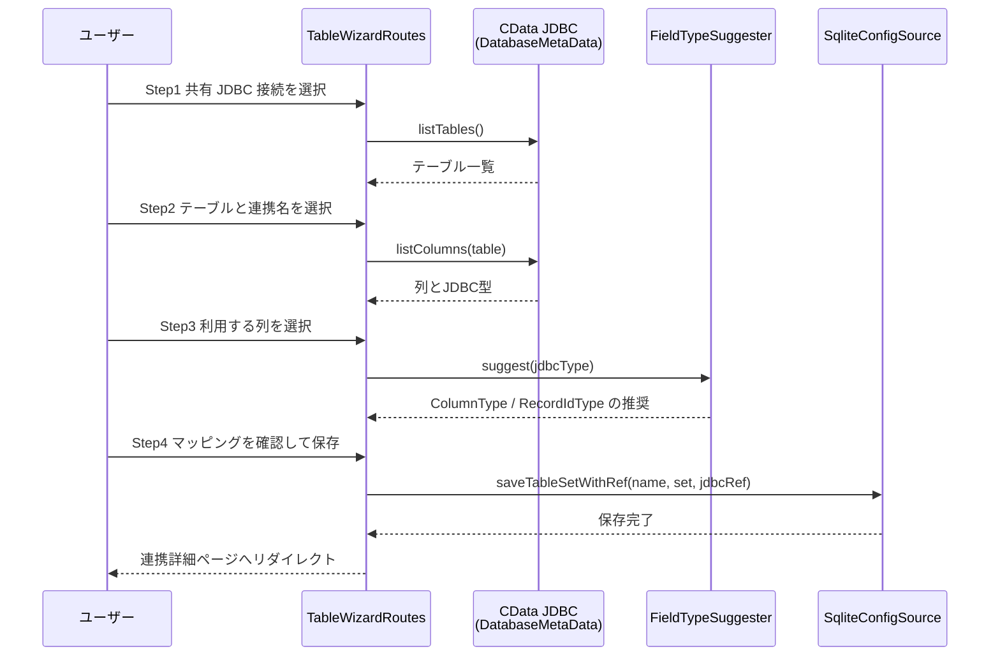
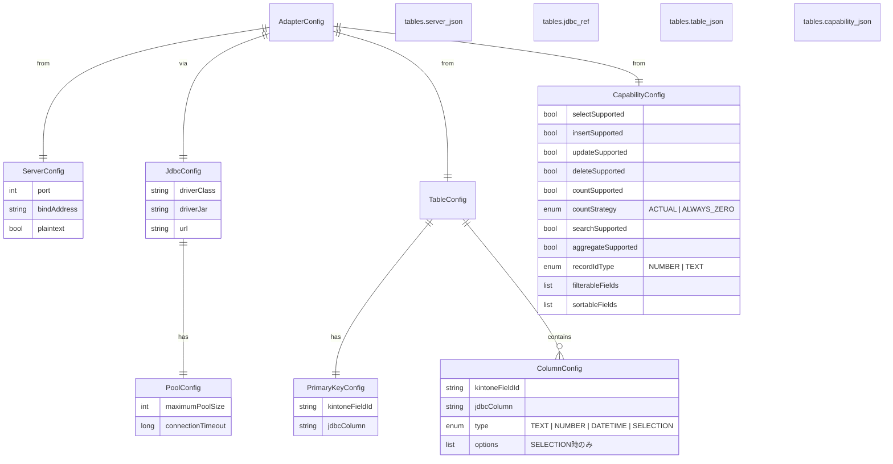
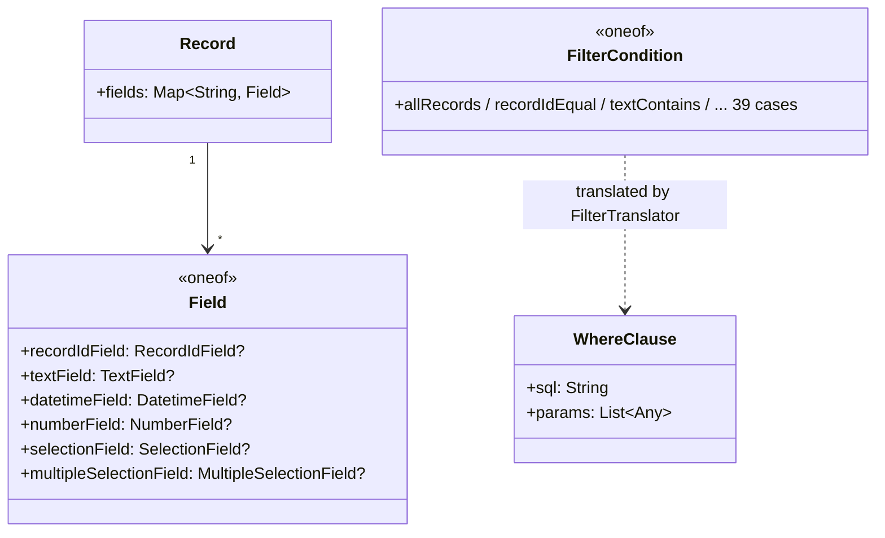

# 機能設計書（Functional Design Document）

| 項目 | 内容 |
|---|---|
| プロダクト名 | kintone External App CData Adapter Sample |
| バージョン | 1.0（フェーズ1） |
| 作成日 | 2026-05-15 |
| ステータス | ドラフト（承認待ち） |

---

## 1. システム構成

### 1.1 全体アーキテクチャ図



### 1.2 モジュール責務

| モジュール | 提供元 | 責務 |
|---|---|---|
| kintone アプリ | サイボウズ | エンドユーザーが操作するアプリ画面・API |
| Connector | サイボウズ | kintone 側のインターフェース。操作イベントを Agent へ送信 |
| **Agent** | サイボウズ（バイナリ） | Connector からの gRPC を受け、Adapter への Connect RPC 呼出に変換 |
| **Adapter** | **本プロジェクト** | Agent からの Connect RPC を受け、JDBC 経由でデータソースを操作 |
| HikariCP | OSS | JDBC 接続プール管理 |
| CData JDBC Driver | CData | データソース固有プロトコルへの変換層 |

### 1.3 通信プロトコル

| 区間 | プロトコル | ポート | 認証 |
|---|---|---|---|
| kintone ↔ Connector | kintone 内部 | - | - |
| Connector ↔ Agent | gRPC 双方向ストリーミング | 443 (HTTPS) | RSA 2048 + JWT |
| Agent ↔ Adapter | Connect RPC (HTTP/2 + JSON/binary) | 8083（デフォルト） | TLS可（フェーズ1は plaintext） |
| Adapter ↔ CData JDBC | Java in-process | - | - |
| CData JDBC ↔ データソース | データソース依存（HTTPS, ODBC等） | データソース依存 | データソース依存 |

詳細仕様は `.claude/skills/kintone-external-app-spec/reference/01-architecture.md` 参照。

---

## 2. リクエスト処理フロー

### 2.1 シーケンス図：レコード一覧取得（Select）



### 2.2 シーケンス図：レコード追加（Insert）



### 2.3 起動シーケンス



---

## 3. コンポーネント設計

### 3.1 内部モジュール構成



### 3.2 各層の責務

| 層 | 主要クラス | 責務 |
|---|---|---|
| **エントリポイント** | `Application.kt` | コマンドライン引数のパース → サブコマンドディスパッチ |
| **cli** | `WebUiCommand`, `ServeCommand`, `ServeAllCommand`, `ListActiveCommand`, `ListTablesCommand`, `TestConnectionCommand` | サブコマンド毎の処理。CLI ライブラリは Clikt を採用 |
| **config** | `AdapterConfig`, `ConfigSource`, `ConfigStore`, `SqliteConfigSource`, `SqliteSchema`, `EnvVarExpander` | SQLite への設定の読込・書出 |
| **service** | `AdapterServiceImpl` | AdapterService の 9 RPC 実装 |
| **metadata** | `JdbcMetadataInspector`, `FieldTypeSuggester` | `DatabaseMetaData` を介したテーブル一覧・カラム情報取得、JDBC型→kintone型の推奨ロジック |
| **jdbc** | `JdbcConnectionProvider`, `QueryBuilder`, `RowMapper`, `TypeMapper` | JDBC 接続管理・SQL組立・ResultSet⇄Record変換 |
| **filter** | `FilterTranslator`, `WhereClause` | 39 FilterCondition → SQL WHERE 句変換 |
| **proto** | （自動生成） | protobuf 型・Kotlin スタブ |

### 3.3 クラス図（主要部分）



### スキーマの扱い

`TableConfig.schema` は**省略可能**。スキーマを持たないデータソースでは `null` になる。

実行時クエリは `qualifiedName()` が返す修飾名を使う。

| `schema` | `qualifiedName()` | 用途 |
|---|---|---|
| `"SalesLT"` | `[SalesLT].[Customer]` | スキーマを持つデータソース |
| `null` | `[Customer]` | スキーマを持たないデータソース／スキーマ項目の無い既存設定 |

**テーブル名にドットを含めて修飾する方式は採らない。** `SqlIdentifier.quote` は
`SalesLT.Customer` を 1 つの識別子として扱うため、独立した項目として持つ。

連携追加ウィザードでは、スキーマが 2 種類以上あるときだけ step2 に選択 UI を出し、
1 スキーマに絞って表示する。絞らないと、どのテーブルがどのスキーマのものかを
hidden 1 つでは送れない。

関連: [Issue #63](https://github.com/sugimomoto/KintoneExternalAppCDataSample/issues/63)

---

## 4. ユースケース図



各ユースケース対応の詳細はユーザーストーリー（[product-requirements.md](product-requirements.md) §6）参照。

### 4.1 CLI サブコマンド一覧

| サブコマンド | 用途 | 引数（主要） |
|---|---|---|
| `web-ui` | 管理コンソール起動 | `--port`, `--config-dir`, `--lib-dir`, `--sqlite-path` |
| `serve` | 指定連携の RPC サーバ起動 | `--table` / `--tables`（必須）, `--config-dir` |
| `serve-all` | 登録済み全連携を起動 | `--config-dir`, `--sqlite-path` |
| `list-active` | 稼働中 Adapter 一覧 | `--state-file` |
| `list-tables` | テーブル一覧表示 | `--jdbc-name`, `--config-dir` |
| `test-connection` | JDBC 接続テスト | `--jdbc-name`, `--config-dir` |

連携の作成・編集は Web UI（`/syncs/new`）から行う。CLI には作成手段を持たない。

### 4.2 新規連携ウィザード（Web UI）

連携の作成は CLI ではなく Web UI の 4 ステップウィザード（`/syncs/new`）で行う。



---

## 5. データモデル

### 5.1 設定データモデル（SQLite）

設定は `config/config.db` に保存する。テーブルは 3 つ。

```
config.db
├ shared_jdbcs   # 共有 JDBC 接続（JdbcConfig を JSON で保持）
├ tables         # 連携ごとの設定（server / table / capability を JSON で保持 + jdbc_ref）
└ schema_meta    # スキーマバージョン
```

ランタイムでは `ConfigSource.loadTableSet(name)` が 1 連携分の行を読み、
`jdbc_ref` から共有 JDBC 設定を解決して `AdapterConfig`（= `TableConfigSet`）に統合する。



### 5.2 ドメインモデル（protobuf 由来）



詳細な型定義は `.claude/skills/kintone-external-app-spec/reference/03-field-types.md` および `04-filter-conditions.md` 参照。

---

## 6. データソース ↔ kintone 型マッピング

### 6.1 JDBC型 → protobuf Field 型

| JDBC型 (java.sql.Types) | kintone Field 型 | 設定ファイル `type` | 備考 |
|---|---|---|---|
| `VARCHAR` / `CHAR` / `LONGVARCHAR`（主キー） | `RecordIdField` (TEXT) | `record-id-type: TEXT` | Salesforce ID 等 |
| `BIGINT` / `INTEGER`（主キー） | `RecordIdField` (NUMBER) | `record-id-type: NUMBER` | DB auto-increment |
| `VARCHAR` / `CHAR` / `LONGVARCHAR` | `TextField` | `TEXT` | |
| `BIGINT` / `INTEGER` / `SMALLINT` / `DECIMAL` / `NUMERIC` / `FLOAT` / `DOUBLE` / `REAL` | `NumberField` | `NUMBER` | 全て double（精度損失リスク） |
| `TIMESTAMP` / `DATE` / `TIME` | `DatetimeField` | `DATETIME` | UTC 変換 |
| `VARCHAR` + 選択肢一覧あり | `SelectionField` | `SELECTION` + `options` | |
| `BOOLEAN` | `TextField` or `SelectionField` | `TEXT` or `SELECTION` | 直接対応なし |
| `BLOB` / `CLOB` | 非対応 | - | kintone側にフィールド型なし |

### 6.2 protobuf Timestamp ↔ JDBC Timestamp 変換規約

- すべて **UTC** で扱う
- protobuf `google.protobuf.Timestamp` → `java.sql.Timestamp`：`Timestamp.from(Instant.ofEpochSecond(s, n))`
- 逆変換も同様
- データソース固有のタイムゾーン設定（CData JDBC のプロパティ等）に依存しない

---

## 7. API設計

### 7.1 外部 API：AdapterService（Connect RPC）

`cybozu.data_connector.adapter.v1.AdapterService` の 9 RPC。

各 RPC のシグネチャ・呼ばれるタイミング・必須/任意・バリデーション制約は、専用スキルに整理済み：

→ `.claude/skills/kintone-external-app-spec/reference/02-api-surface.md`

ローカル動作確認用 curl コマンド集：

→ `.claude/skills/kintone-external-app-spec/reference/09-curl-test-snippets.md`

CData JDBC への変換規約：

→ `.claude/skills/kintone-external-app-spec/reference/08-jdbc-mapping.md`

### 7.2 内部 API（モジュール間境界）

| 呼び元 | 呼び先 | メソッド/操作 | 概要 |
|---|---|---|---|
| `AdapterServiceImpl.select` | `FilterTranslator` | `translate(conditions, matchOperator): WhereClause` | FilterCondition → SQL/params 変換 |
| `AdapterServiceImpl.select` | `QueryBuilder` | `buildSelect(table, columns, where, orderBy, limit, offset): PreparedQuery` | SQL 文字列＋パラメータの組立 |
| `AdapterServiceImpl.select` | `JdbcConnectionProvider` | `connection(): Connection` | プールから JDBC Connection 借用（try-with-resources） |
| `AdapterServiceImpl.select` | `RowMapper` | `rsToRecord(rs: ResultSet): Record` | ResultSet 1行 → protobuf Record |
| `AdapterServiceImpl.insert` | `RowMapper` | `recordToParams(record: Record): Map` | Record → INSERT 用パラメータ |

---

## 8. エラー処理設計

### 8.1 エラー分類と Connect エラーコード

| エラー種別 | Connect Code | HTTP Status |
|---|---|---|
| リクエストバリデーション失敗（必須欠落・形式不正） | `INVALID_ARGUMENT` | 400 |
| サポートされていない FilterCondition | `UNIMPLEMENTED` | 501 |
| サポートされていない field_id | `INVALID_ARGUMENT` | 400 |
| DB 接続失敗（一時的） | `UNAVAILABLE` | 503 |
| SQL 例外（不正な SQL） | `INTERNAL` | 500 |
| Update での ID 未指定 | `INVALID_ARGUMENT` | 400 |
| その他予期せぬ例外 | `INTERNAL` | 500 |

### 8.2 トランザクション境界

| RPC | トランザクション |
|---|---|
| `Select` / `Count` / `Search` / `Aggregate` | 読み取り専用、トランザクション不要 |
| `Insert` / `Update` / `Delete` | **必須**: 開始 → 各レコード処理 → コミット、例外時ロールバック |

### 8.3 Count 戦略

`adapter.capability.count-strategy` で挙動を選択：

```mermaid
flowchart TD
    REQ[Count リクエスト受信]
    CHECK{count-strategy?}
    SQL[SELECT COUNT(*)<br/>FROM table WHERE ...]
    DB[(データソース)]
    ZERO[count = 0 を直接返却]
    RESP[CountResponse 返却]

    REQ --> CHECK
    CHECK -- ACTUAL --> SQL
    SQL --> DB
    DB --> RESP
    CHECK -- ALWAYS_ZERO --> ZERO
    ZERO --> RESP
```

- **ACTUAL（デフォルト）**: 通常の `SELECT COUNT(*)` クエリを実行
- **ALWAYS_ZERO**: DB クエリを発行せず即座に `count: 0` を返却。Salesforce のような大規模オブジェクトで COUNT が重いケース向け
- kintone のページング UI の動作に影響するため、READMEで明示的に説明する

データソースによってはトランザクション未サポート（Salesforce 等）。その場合は `autoCommit = true` で動作する分岐を実装。

---

## 9. ロギング設計

### 9.1 ログレベル方針

| レベル | 用途 |
|---|---|
| `ERROR` | 例外・処理失敗。スタックトレース付き |
| `WARN` | バリデーション失敗・想定外の入力 |
| `INFO` | RPC 呼出（開始・終了）、設定読込、起動完了 |
| `DEBUG` | SQL 文字列・バインドパラメータ・FilterCondition の変換結果 |
| `TRACE` | ResultSet の全カラム値 |

### 9.2 機密情報の取扱い

- JDBC 接続文字列をログに出力する場合は **パスワード部分をマスキング**
- リクエストパラメータの値をログに出す場合は **DEBUG 以下のみ**（INFO には出さない）

---

## 10. 設定変更時の挙動

| 変更内容 | 対応 |
|---|---|
| Web UI での設定変更 | Adapter の再起動が必要（ホットリロードは行わない） |
| JDBC Driver の JAR 更新 | プロセス再起動が必要 |
| データソース側のスキーマ変更 | Web UI で列マッピングを更新後、Adapter を再起動 |

ホットリロードは将来フェーズで検討。

---

## 11. 拡張ポイント

将来的にユーザーがカスタマイズする可能性が高い箇所：

| 箇所 | 想定カスタマイズ |
|---|---|
| `RowMapper` | データソース固有の型変換（例: Salesforce の `Id` を カスタム変換） |
| `FilterTranslator` | データソース固有の SQL 方言対応（例: SOSL fallback） |
| `QueryBuilder` | データソース固有のページネーション・ヒント句 |
| `AdapterServiceImpl.search` | データソース固有の全文検索（SOSL / FULLTEXT / tsvector） |

---

## 12. 関連ドキュメント

- プロダクト要求：[product-requirements.md](product-requirements.md)
- 技術仕様：[architecture.md](architecture.md)
- リポジトリ構造：[repository-structure.md](repository-structure.md)
- 開発ガイドライン：[development-guidelines.md](development-guidelines.md)
- ユビキタス言語：[glossary.md](glossary.md)
- kintone Adapter 仕様詳細：[.claude/skills/kintone-external-app-spec/](../.claude/skills/kintone-external-app-spec/)
